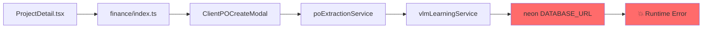

# Client/Server Boundary Guide

## Overview

Next.js applications have a critical boundary between client-side (browser) and server-side code. Violating this boundary causes runtime errors and security issues.

```mermaid
graph TB
    subgraph "Browser (Client)"
        Pages[Pages/*.tsx]
        Components[Components]
        Hooks[React Query Hooks]
        Services[API Services]
    end

    subgraph "Server Only"
        APIRoutes[pages/api/*.ts]
        DBServices[DB Services]
        Neon[(Neon PostgreSQL)]
        EnvVars[Environment Variables]
    end

    subgraph "Build Time"
        Webpack[Webpack Bundler]
        TreeShake[Tree Shaking]
    end

    Pages --> Hooks
    Hooks --> Services
    Services -->|fetch()| APIRoutes
    APIRoutes --> DBServices
    DBServices --> Neon

    Webpack -->|bundles| Pages
    Webpack -->|bundles| Components
    Webpack -.->|should NOT bundle| Neon
```

## The Bundling Problem

### What Happens

1. Webpack bundles all imported code into client JavaScript
2. If ANY import chain reaches server-only code, it gets bundled
3. Server-only code fails in browser (no `DATABASE_URL`, no Node APIs)

### Example Failure Chain



**Error**: `"No database connection string was provided to neon()"`

## Safe Import Patterns

### Client-Side Code (Safe)

```typescript
// ✅ SAFE: Import from API services
import { projectApiService } from '@/services/project/projectApiService';

// ✅ SAFE: Import React Query hooks
import { useProject } from '@/hooks/useProjects';

// ✅ SAFE: Import types (types are erased at runtime)
import type { Project } from '@/types/project.types';

// ✅ SAFE: Direct component import (avoids barrel)
import { FinanceDashboardTab } from '@/modules/projects/components/finance/FinanceDashboardTab';
```

### Client-Side Code (Dangerous)

```typescript
// ❌ DANGEROUS: Barrel export may include server code
import { FinanceDashboardTab } from '@/modules/projects/components/finance';

// ❌ DANGEROUS: Direct Neon import
import { neon } from '@neondatabase/serverless';

// ❌ DANGEROUS: Service that uses Neon directly
import { vlmLearningService } from '@/services/vlmLearningService';

// ❌ DANGEROUS: Any file with top-level neon() call
import { someFunction } from './fileWithNeonAtTopLevel';
```

### Server-Side Code (API Routes Only)

```typescript
// pages/api/projects/[id].ts
import { neon } from '@neondatabase/serverless';

// ✅ This is safe - only runs on server
const sql = neon(process.env.DATABASE_URL!);

export default async function handler(req, res) {
  const result = await sql`SELECT * FROM projects WHERE id = ${req.query.id}`;
  return res.json({ data: result[0] });
}
```

## Code Organization Rules

### Rule 1: API Services are HTTP-Only

```typescript
// src/services/project/projectApiService.ts
// ✅ Only uses fetch() - safe for client

export const projectApiService = {
  async getById(id: string): Promise<Project> {
    const res = await fetch(`/api/projects/${id}`);
    const data = await res.json();
    return data.data;
  }
};
```

### Rule 2: Database Access Only in API Routes

```typescript
// pages/api/projects/[id].ts
// ✅ Neon only used here - never imported by client code

import { neon } from '@neondatabase/serverless';
const sql = neon(process.env.DATABASE_URL!);
```

### Rule 3: Avoid Module-Level Neon Instantiation

```typescript
// ❌ BAD: Executes at import time
const sql = neon(process.env.DATABASE_URL!);

export function getData() {
  return sql`SELECT * FROM table`;
}

// ✅ GOOD: Executes only when called
export function getData() {
  const sql = neon(process.env.DATABASE_URL!);
  return sql`SELECT * FROM table`;
}
```

### Rule 4: Use Direct Imports, Not Barrels

```typescript
// ❌ Barrel export - may pull in server code
import { ComponentA, ComponentB } from '@/modules/feature';

// ✅ Direct imports - only get what you need
import { ComponentA } from '@/modules/feature/components/ComponentA';
import { ComponentB } from '@/modules/feature/components/ComponentB';
```

## Debugging Bundling Issues

### Step 1: Check Browser Console

Look for errors like:
- `"No database connection string was provided to neon()"`
- `"process is not defined"`
- `"fs is not defined"`

### Step 2: Trace Import Chain

```bash
# Find where Neon is imported
grep -r "from '@neondatabase" src/

# Find what imports a suspicious file
grep -r "from '.*vlmLearningService'" src/
```

### Step 3: Check Barrel Exports

```bash
# List all index.ts files
find src -name "index.ts" -type f

# Check what a barrel exports
cat src/modules/feature/components/index.ts
```

### Step 4: Verify Fix

1. Run `npm run build`
2. Check browser console for errors
3. Verify page loads correctly

## File Classification

### Always Client-Safe

| Path Pattern | Reason |
|--------------|--------|
| `src/components/**/*.tsx` | UI components |
| `src/hooks/**/*.ts` | React Query hooks |
| `src/services/**/*ApiService.ts` | HTTP-only services |
| `src/types/**/*.ts` | Type definitions |
| `src/lib/apiResponse.ts` | Response helpers |

### Server-Only (Never Import from Client)

| Path Pattern | Reason |
|--------------|--------|
| `pages/api/**/*.ts` | API routes |
| `src/services/**/*DbService.ts` | Direct DB access |
| `**/sql.ts` | Neon client |
| Any file with `neon()` at top level | Module-level DB connection |

### Requires Caution

| Path Pattern | Risk |
|--------------|------|
| `src/modules/**/index.ts` | May re-export server code |
| `src/services/**/*.ts` | Check for Neon imports |
| Files importing from barrels | Transitive dependencies |

## Quick Reference

```
CLIENT CODE                    SERVER CODE
─────────────────────────────────────────────────
Pages (*.tsx)          ───►    API Routes (pages/api/)
Components             ───►    DB Services
Hooks                  ───►    Neon Client
API Services (fetch)   ───►    Environment Variables

        ▲                              │
        │         fetch()              │
        └──────────────────────────────┘
```

**Golden Rule**: If it touches the database, it belongs in `pages/api/`. Everything else uses `fetch()` to call those APIs.
