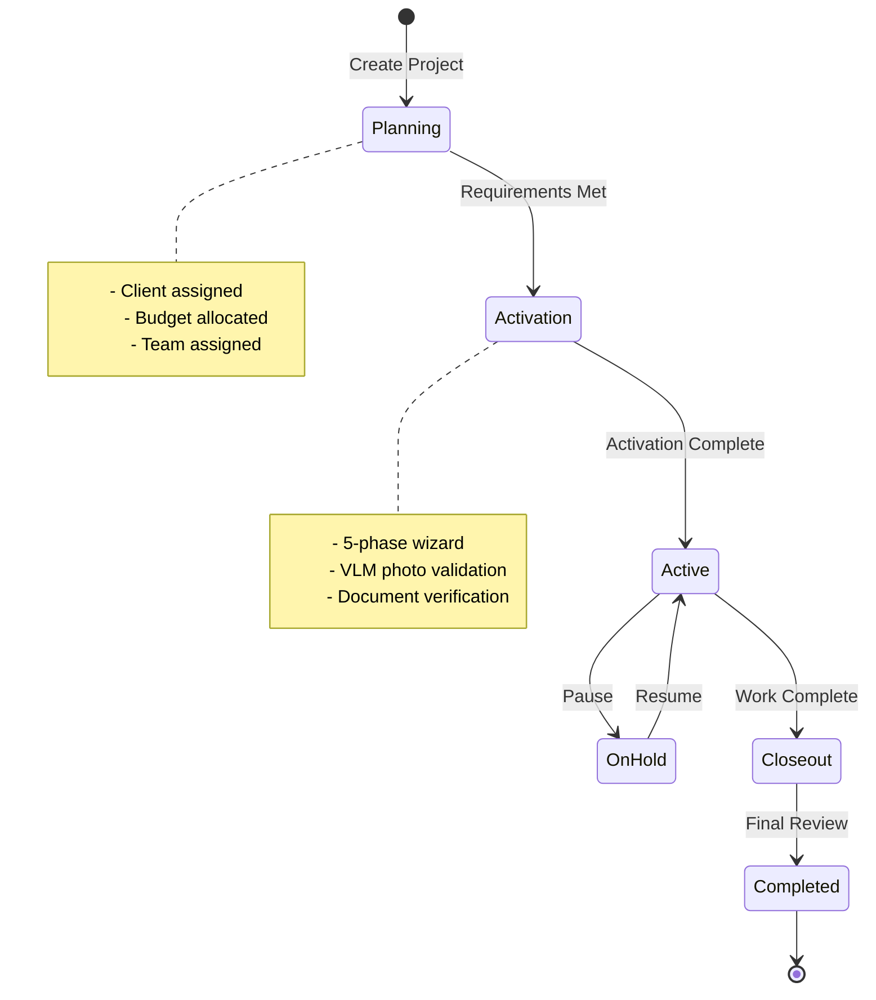
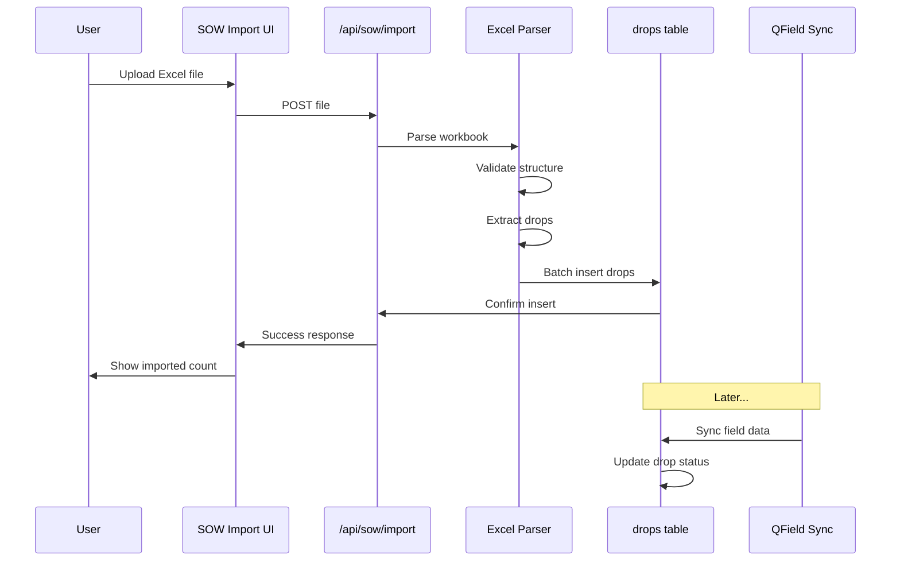
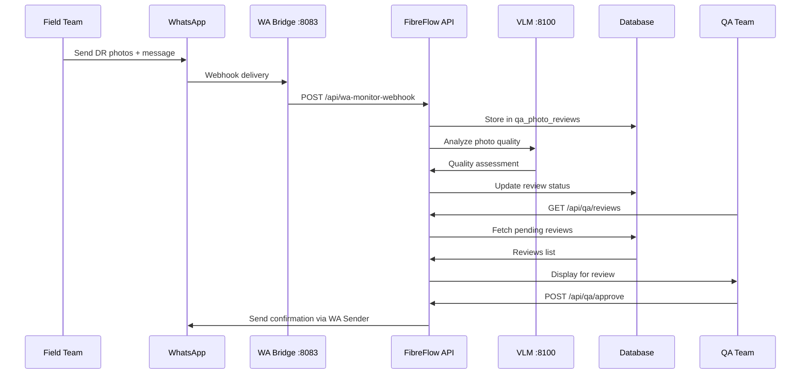
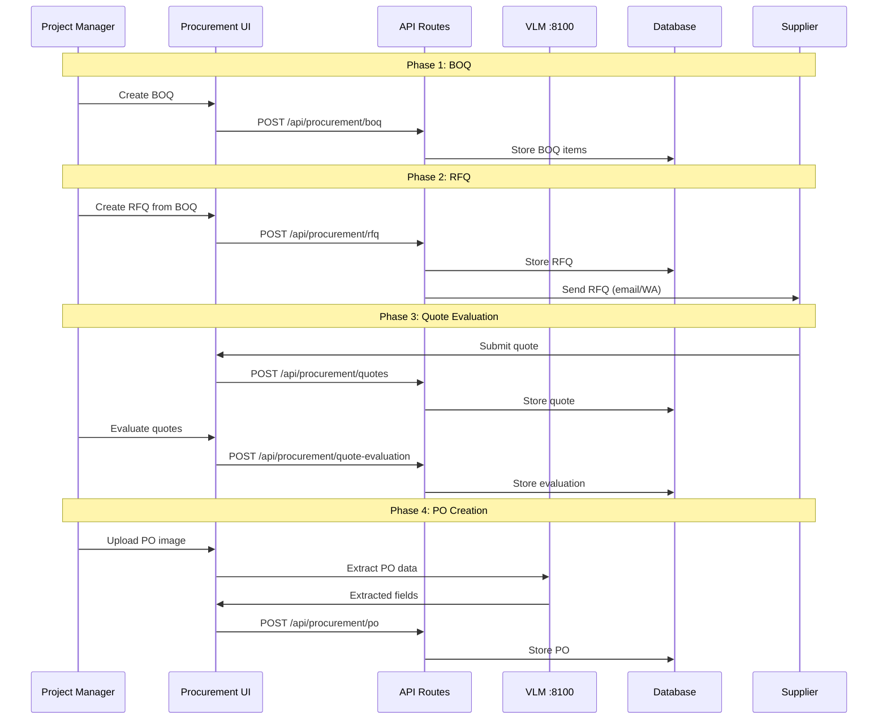
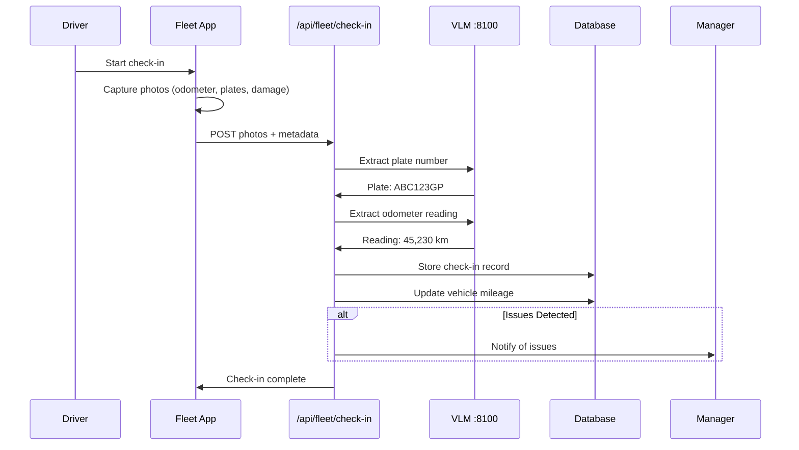
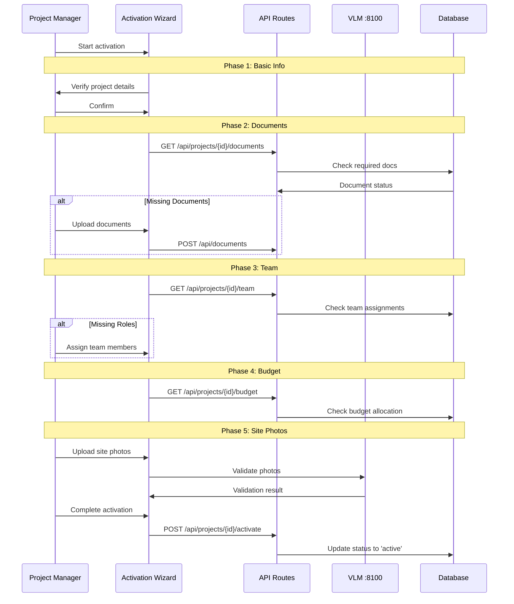
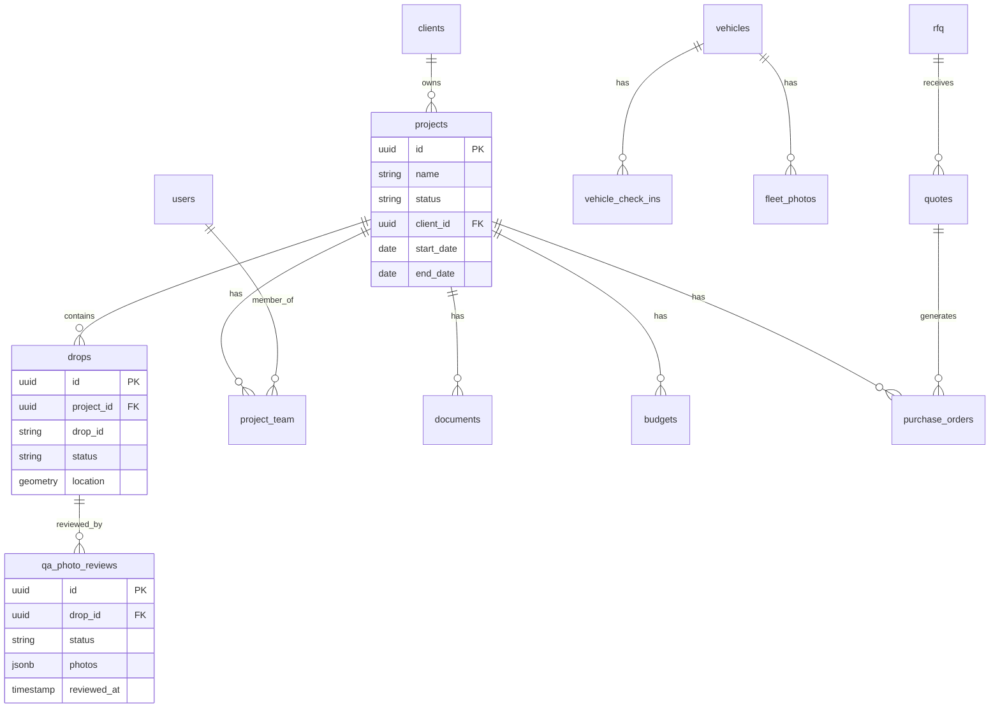

# Data Flow Diagrams

## Core Data Flows

### 1. Project Lifecycle

### 2. SOW Import Flow

**Key Tables**: `drops`, `sow_imports`

### 3. Daily Reporting & QA Flow

**Key Tables**: `qa_photo_reviews`, `dr_photos`, `dr_photo_unified_reviews`

### 4. Procurement Flow

**Key Tables**: `boq_items`, `rfq`, `quotes`, `purchase_orders`

### 5. Fleet Check-in Flow

**Key Tables**: `vehicle_check_ins`, `vehicles`, `fleet_photos`

### 6. Project Activation Flow

**Key Tables**: `projects`, `project_team`, `documents`, `budgets`

## Database Schema Overview

## Key Data Relationships

| Source | Relationship | Target | Notes |
|--------|--------------|--------|-------|
| `projects` | 1:N | `drops` | SOW data |
| `projects` | 1:N | `project_team` | Team assignments |
| `projects` | 1:N | `documents` | Project documents |
| `projects` | 1:N | `purchase_orders` | Procurement |
| `clients` | 1:N | `projects` | Client ownership |
| `users` | N:M | `projects` | Via `project_team` |
| `drops` | 1:N | `qa_photo_reviews` | QA workflow |
| `vehicles` | 1:N | `vehicle_check_ins` | Fleet tracking |
| `rfq` | 1:N | `quotes` | Quote collection |

## Critical Table Disambiguation

**Two "drops" concepts exist - do not confuse:**

| Table | Purpose | API | Module |
|-------|---------|-----|--------|
| `drops` | SOW import data | `/api/sow/drops` | SOW |
| `qa_photo_reviews` | WhatsApp DR photos | `/api/wa-monitor-*` | WA Monitor |

They are NOT the same table despite similar naming in the UI.
