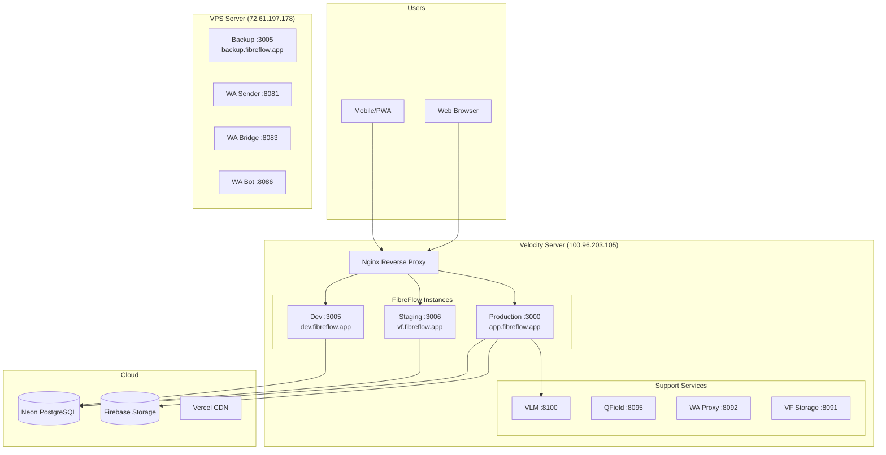
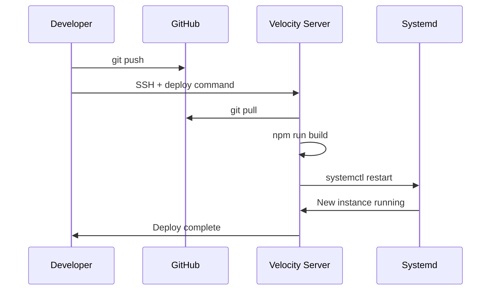
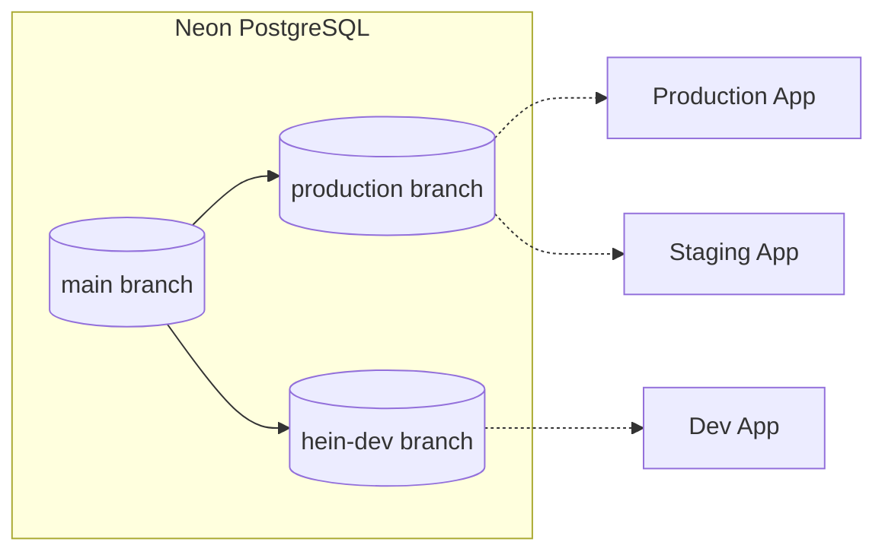

# Deployment Architecture

## Environment Overview



## Server Inventory

### Velocity Server (100.96.203.105)

| Service | Port | Systemd Unit | Purpose |
|---------|------|--------------|---------|
| Production | 3000 | `fibreflow-production.service` | Live app |
| Staging | 3006 | `fibreflow.service` | Testing |
| Dev | 3005 | `fibreflow-dev.service` | Development |
| VLM | 8100 | `vlm.service` | AI analysis |
| QField Sync | 8095 | `qfield-sync.service` | GIS sync |
| WA Proxy | 8092 | `wa-proxy.service` | WA routing |
| VF Storage | 8091 | `vf-storage.service` | File proxy |

**Access**: `ssh velo@100.96.203.105` (password: velo2026)

### VPS Server (72.61.197.178)

| Service | Port | Systemd Unit | Purpose |
|---------|------|--------------|---------|
| Backup | 3005 | `fibreflow-backup.service` | Failover |
| WA Sender | 8081 | `wa-sender.service` | Outbound WA |
| WA Bridge | 8083 | `wa-bridge.service` | Inbound WA |
| WA Bot | 8086 | `wa-bot.service` | Admin commands |

**Access**: `ssh root@72.61.197.178`

## Directory Structure

### Velocity Server

```
/home/velo/
└── fibreflow-production/     # Production app
    ├── .next/                # Built Next.js
    ├── node_modules/
    └── ...

/home/hein/apps/
└── fibreflow-dev/            # Dev app

/home/louis/apps/
└── fibreflow/                # Staging app (vf.fibreflow.app)
```

### VPS Server

```
/root/
└── fibreflow-backup/         # Backup instance
```

## Deployment Commands

### Quick Deploy

```bash
# Development
sshpass -p 'velo2026' ssh velo@100.96.203.105 \
  "cd /home/hein/apps/fibreflow-dev && git pull && npm run build && echo 'velo2026' | sudo -S systemctl restart fibreflow-dev.service"

# Staging (vf.fibreflow.app)
sshpass -p 'velo2026' ssh velo@100.96.203.105 \
  "cd /home/louis/apps/fibreflow && git pull && npm run build && echo 'velo2026' | sudo -S systemctl restart fibreflow.service"

# Production
sshpass -p 'velo2026' ssh velo@100.96.203.105 \
  "cd /home/velo/fibreflow-production && git pull && npm run build && echo 'velo2026' | sudo -S systemctl restart fibreflow-production.service"
```

### Deploy Flow



## Database Configuration

### Neon Branching



| Environment | Branch | Endpoint |
|-------------|--------|----------|
| Production | `production` | `ep-dry-night-a9qyh4sj` |
| Staging | `production` | `ep-dry-night-a9qyh4sj` |
| Development | `hein-dev` | `ep-aged-poetry-a9bbd8e9` |

**Important**: Production and Staging share the same database!

## Nginx Configuration

### Domain Routing

```nginx
# /etc/nginx/sites-available/fibreflow

# Production
server {
    server_name app.fibreflow.app;
    location / {
        proxy_pass http://localhost:3000;
    }
}

# Staging
server {
    server_name vf.fibreflow.app;
    location / {
        proxy_pass http://localhost:3006;
    }
}

# Development
server {
    server_name dev.fibreflow.app;
    location / {
        proxy_pass http://localhost:3005;
    }

    # Storage proxy for dev
    location /storage/ {
        proxy_pass http://localhost:8091/;
    }
}
```

## Systemd Service Template

```ini
# /etc/systemd/system/fibreflow-production.service

[Unit]
Description=FibreFlow Production
After=network.target

[Service]
Type=simple
User=velo
WorkingDirectory=/home/velo/fibreflow-production
ExecStart=/usr/bin/npm start
Restart=on-failure
Environment=NODE_ENV=production
Environment=PORT=3000

[Install]
WantedBy=multi-user.target
```

## Monitoring

### Service Status

```bash
# Check all FibreFlow services
systemctl status fibreflow-production.service
systemctl status fibreflow.service
systemctl status fibreflow-dev.service

# Check support services
systemctl status vlm.service
systemctl status wa-sender.service
```

### Log Access

```bash
# View service logs
journalctl -u fibreflow-production.service -f

# View Nginx access logs
tail -f /var/log/nginx/access.log
```

### Health Checks

```bash
# App health
curl https://app.fibreflow.app/api/health

# VLM health
curl http://100.96.203.105:8100/health

# WA services
curl http://72.61.197.178:8081/health
curl http://72.61.197.178:8083/health
```

## Build IDs

Each deployment generates a unique BUILD_ID in `.next/BUILD_ID`:

```bash
# Check current build IDs
cat /home/velo/fibreflow-production/.next/BUILD_ID    # Production
cat /home/louis/apps/fibreflow/.next/BUILD_ID         # Staging
cat /home/hein/apps/fibreflow-dev/.next/BUILD_ID      # Dev
```

## Rollback Procedure

```bash
# 1. SSH to server
ssh velo@100.96.203.105

# 2. Navigate to app directory
cd /home/velo/fibreflow-production

# 3. Check git log for previous commit
git log --oneline -5

# 4. Reset to previous commit
git reset --hard <commit-hash>

# 5. Rebuild and restart
npm run build
sudo systemctl restart fibreflow-production.service
```

## Environment Variables

All environments require these variables in `.env.local`:

```bash
# Database
DATABASE_URL=postgresql://...

# Firebase
FIREBASE_PROJECT_ID=fibreflow-production
FIREBASE_PRIVATE_KEY=...
FIREBASE_CLIENT_EMAIL=...

# External Services
VLM_URL=http://100.96.203.105:8100
WA_SENDER_URL=http://72.61.197.178:8081
ONEMAP_API_KEY=...
RESEND_API_KEY=...

# Auth
JWT_SECRET=...
```

## Daily Audit

The daily audit runs at 05:30 to verify all services:

```bash
# Manual run
tsx scripts/daily-audit/runner.ts

# Quick check (P0 only)
tsx scripts/daily-audit/runner.ts --quick
```

Results available at `public/audit-report.html`.
