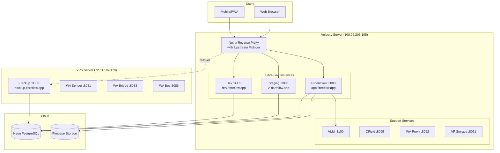
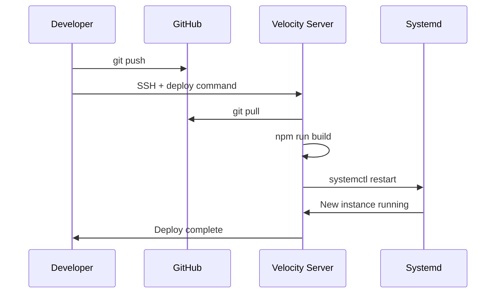
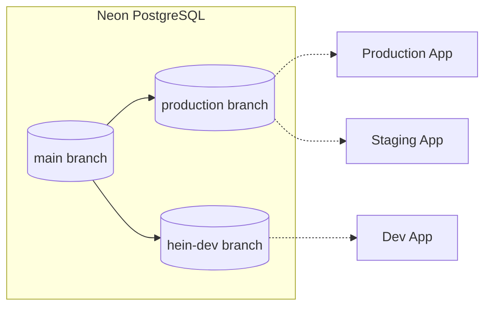

# Deployment Architecture

## Environment Overview



## Failover Architecture

### Nginx Upstream Failover

All environments have automatic failover to VPS backup (72.61.197.178:3005):

```nginx
upstream fibreflow_prod {
    server localhost:3000;
    server 72.61.197.178:3005 backup;
}
upstream fibreflow_staging {
    server localhost:3006;
    server 72.61.197.178:3005 backup;
}
upstream fibreflow_dev {
    server localhost:3005;
    server 72.61.197.178:3005 backup;
}
```

**Triggers:** connection error, timeout, HTTP 502/503/504
**Failover time:** ~0.3s
**Scope:** Covers service-level failures. Full Velocity failure requires Cloudflare LB.

### VPS Backup Auto-Sync

Hourly cron (`/opt/fibreflow/auto-update.sh`) on VPS:
- Fetches latest from GitHub master
- If new commits: pull, build, restart `fibreflow-backup.service`
- Log: `/var/log/fibreflow-autoupdate.log`

### Health Check System

Script: `/home/velo/scripts/fibreflow-health-check-v2.sh` (every 5 min)
- Monitors all services via HTTP health checks
- Auto-restarts failed systemd services and Docker containers
- Logs to `system_recovery_actions` table
- WhatsApp alerts for critical failures

## Server Inventory

### Velocity Server (100.96.203.105)

| Service | Port | Systemd Unit | Purpose |
|---------|------|--------------|---------|
| Production | 3000 | `fibreflow-production.service` | Live app |
| Staging | 3006 | `fibreflow.service` | Testing |
| Dev | 3005 | `fibreflow-dev.service` | Development |
| VLM | 8100 | `vllm-qwen.service` | AI analysis (Qwen3-VL-8B) |
| QField Sync | 8095 | `qfield-sync.service` | GIS sync |
| WA Feedback | 8092 | `wa-feedback.service` | WA message proxy → VPS bridge |
| VF Storage | 8091 | `fibreflow-storage.service` | Fleet photo storage |

**Access:**
- `ssh velo@100.96.203.105` — SSH key auth from hein's workstation, sudo/root, ALL deploys
- `ssh zander@100.96.203.105` (password: zander2026) — sudo, full deploy access
- `ssh hein@100.96.203.105` (password: 0203) — personal account

**All deploy directories unified under /home/velo/ (2026-02-11).** No more permission issues.

### VPS Server (72.61.197.178)

| Service | Port | Systemd Unit | Purpose |
|---------|------|--------------|---------|
| Backup | 3005 | `fibreflow-backup.service` | Failover |
| WA Bridge | 8083 | `whatsapp-bridge.service` | Inbound + outbound WA (direct-send, 063 841 2276) |
| WA Command Bot | 8086 | `wa-command-bot.service` | Admin commands (Python) |

**WA Sender (8081) was REMOVED Feb 2026** — bridge now sends directly via its own WhatsApp client.

**Access**: `ssh root@72.61.197.178`

## Directory Structure

### Velocity Server

```
/home/velo/
├── fibreflow-production/     # Production app (app.fibreflow.app)
├── fibreflow-staging/        # Staging app (vf.fibreflow.app)
└── fibreflow-dev/            # Dev app (dev.fibreflow.app)
```

All three directories owned by `velo:velo`, same user, no permission issues.

### VPS Server

```
/opt/fibreflow/                # Backup instance (fibreflow-backup.service)
/opt/fibreflow/auto-update.sh  # Hourly auto-sync cron script
```

## Deployment Commands

### Quick Deploy

All deploys use the `velo` user via SSH key auth (no passwords needed for SSH).

```bash
# Development (dev.fibreflow.app)
ssh velo@100.96.203.105 \
  "cd /home/velo/fibreflow-dev && git pull && npm run build && echo 'velo2026' | sudo -S systemctl restart fibreflow-dev.service"

# Staging (vf.fibreflow.app)
ssh velo@100.96.203.105 \
  "cd /home/velo/fibreflow-staging && git pull && npm run build && echo 'velo2026' | sudo -S systemctl restart fibreflow.service"

# Production (app.fibreflow.app)
ssh velo@100.96.203.105 \
  "cd /home/velo/fibreflow-production && git pull && npm run build && echo 'velo2026' | sudo -S systemctl restart fibreflow-production.service"
```

**Notes:**
- SSH key auth configured from hein's workstation (no sshpass needed)
- All three dirs under `/home/velo/` — same user, no permission issues
- All three can be deployed in parallel (separate directories, separate services)

### Deploy Flow



## Database Configuration

### Neon Branching



| Environment | Branch | Endpoint |
|-------------|--------|----------|
| Production | `production` | `ep-dry-night-a9qyh4sj` |
| Staging | `production` | `ep-dry-night-a9qyh4sj` |
| Development | `hein-dev` | `ep-aged-poetry-a9bbd8e9` |

**Important**: Production and Staging share the same database!

## Nginx Configuration

### Domain Routing (with Upstream Failover)

```nginx
# /etc/nginx/sites-enabled/vf-fibreflow
# All domains use upstream blocks with VPS backup failover

# Production
server {
    server_name app.fibreflow.app;
    location / {
        proxy_pass http://fibreflow_prod;  # localhost:3000 → VPS:3005 backup
        proxy_next_upstream error timeout http_502 http_503 http_504;
    }
}

# Staging
server {
    server_name vf.fibreflow.app;
    location / {
        proxy_pass http://fibreflow_staging;  # localhost:3006 → VPS:3005 backup
        proxy_next_upstream error timeout http_502 http_503 http_504;
    }
}

# Development
server {
    server_name dev.fibreflow.app;
    location / {
        proxy_pass http://fibreflow_dev;  # localhost:3005 → VPS:3005 backup
        proxy_next_upstream error timeout http_502 http_503 http_504;
    }
}
```

All domains also proxy `/storage/` to `localhost:8091` for fleet photos.

## Systemd Service Template

```ini
# /etc/systemd/system/fibreflow-production.service

[Unit]
Description=FibreFlow Production
After=network.target

[Service]
Type=simple
User=velo
WorkingDirectory=/home/velo/fibreflow-production
ExecStart=/usr/bin/npm start
Restart=on-failure
Environment=NODE_ENV=production
Environment=PORT=3000

[Install]
WantedBy=multi-user.target
```

## Monitoring

### Service Status

```bash
# Check all FibreFlow services
systemctl status fibreflow-production.service
systemctl status fibreflow.service
systemctl status fibreflow-dev.service

# Check support services
systemctl status vllm-qwen.service
systemctl status wa-feedback.service
```

### Log Access

```bash
# View service logs
journalctl -u fibreflow-production.service -f

# View Nginx access logs
tail -f /var/log/nginx/access.log
```

### Health Checks

```bash
# App health
curl https://app.fibreflow.app/api/health

# VLM health
curl http://100.96.203.105:8100/health

# WA Bridge (handles both inbound + outbound since Feb 2026)
curl http://72.61.197.178:8083/health

# WA Feedback proxy (Velocity)
curl http://100.96.203.105:8092/health
```

## Build IDs

Each deployment generates a unique BUILD_ID in `.next/BUILD_ID`:

```bash
# Check current build IDs
cat /home/velo/fibreflow-production/.next/BUILD_ID    # Production
cat /home/velo/fibreflow-staging/.next/BUILD_ID       # Staging
cat /home/velo/fibreflow-dev/.next/BUILD_ID           # Dev
```

## Rollback Procedure

```bash
# 1. SSH to server
ssh velo@100.96.203.105

# 2. Navigate to app directory
cd /home/velo/fibreflow-production

# 3. Check git log for previous commit
git log --oneline -5

# 4. Reset to previous commit
git reset --hard <commit-hash>

# 5. Rebuild and restart
npm run build
sudo systemctl restart fibreflow-production.service
```

## Environment Variables

All environments require these variables in `.env.local`:

```bash
# Database
DATABASE_URL=postgresql://...

# Firebase
FIREBASE_PROJECT_ID=fibreflow-production
FIREBASE_PRIVATE_KEY=...
FIREBASE_CLIENT_EMAIL=...

# External Services
VLM_URL=http://100.96.203.105:8100
WA_BRIDGE_URL=http://72.61.197.178:8083
ONEMAP_API_KEY=...
RESEND_API_KEY=...

# Auth
JWT_SECRET=...
```

## Daily Audit

The daily audit runs at 05:30 to verify all services:

```bash
# Manual run
tsx scripts/daily-audit/runner.ts

# Quick check (P0 only)
tsx scripts/daily-audit/runner.ts --quick
```

Results available at `public/audit-report.html`.
