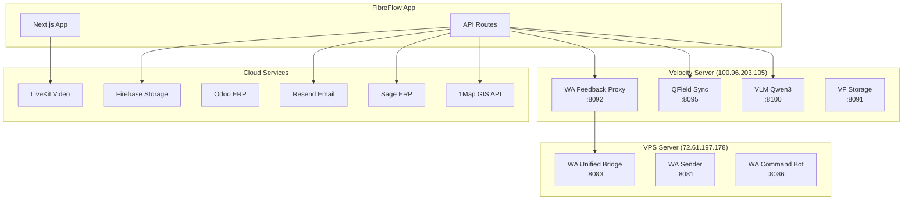
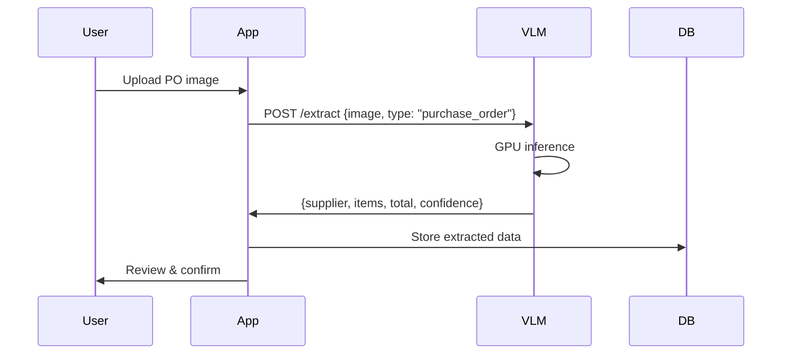
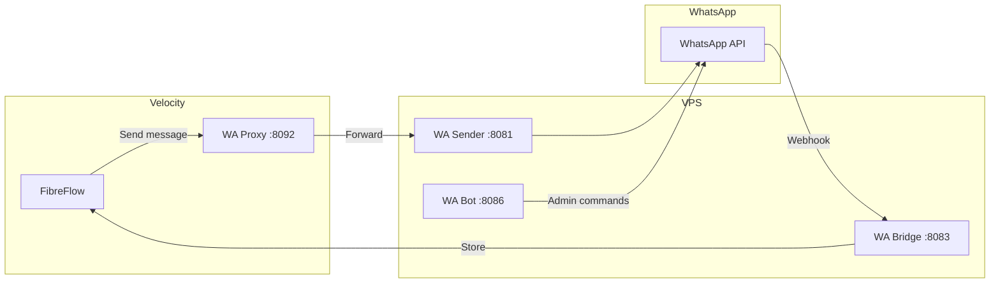
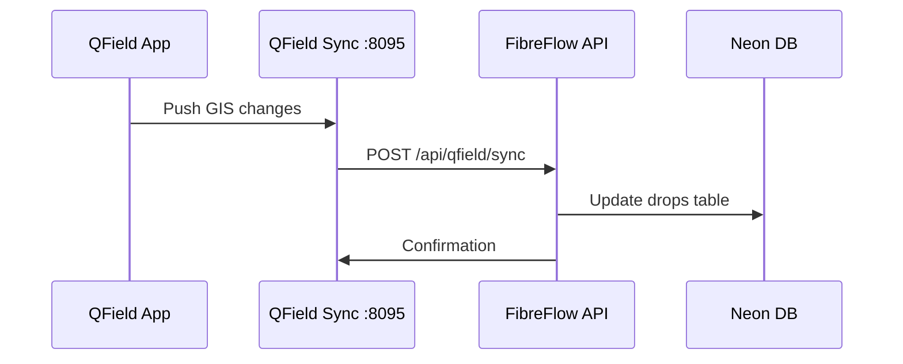

# External Service Integrations

## Service Architecture



## VLM (Vision Language Model)

**Purpose**: AI-powered image analysis for document extraction and photo validation.

| Property | Value |
|----------|-------|
| Server | Velocity (100.96.203.105) |
| Port | 8100 |
| Model | Qwen3 |
| GPU | Required |

### Endpoints

```
GET  /health          # Health check with GPU memory status
POST /extract         # Extract data from images (PO, documents)
POST /analyze         # Analyze DR photos for QA
```

### Usage in FibreFlow



### Key Files

- `src/services/vlmService.ts` - VLM client
- `src/modules/procurement/services/poExtractionService.ts` - PO extraction
- `pages/api/vlm/*.ts` - VLM API routes

### Image Requirements

- Max resolution: 1024x768 (resized automatically)
- Formats: JPEG, PNG
- File size: < 10MB recommended

---

## WhatsApp Integration

**Purpose**: Field team communication, DR photo submissions, QA notifications.

### Architecture



### Services

| Service | Port | Purpose |
|---------|------|---------|
| WA Sender | 8081 | Outbound messages |
| WA Unified Bridge | 8083 | Inbound webhooks, DR submissions |
| WA Command Bot | 8086 | Admin commands (restart, status) |
| WA Feedback Proxy | 8092 | Route messages from Velocity |

### Key Files

- `src/modules/wa-monitor/` - WhatsApp monitoring module
- `pages/api/wa-monitor-*.ts` - WA API routes
- `src/services/whatsappService.ts` - WA client

### Database Tables

- `wa_messages` - Message log
- `qa_photo_reviews` - DR photo submissions (NOT `drops`)
- `wa_sessions` - Active sessions

---

## 1Map GIS Integration

**Purpose**: Geographic data, property lookups, map visualization.

| Property | Value |
|----------|-------|
| Provider | 1Map South Africa |
| Auth | API Key |
| Rate Limit | 1000 req/day |

### Key Features

- Property boundary lookups
- Address geocoding
- Cadastral data
- Route planning

### Key Files

- `src/services/oneMapService.ts` - 1Map client
- `src/modules/wayleaves/` - Property access management
- `pages/api/gis/*.ts` - GIS API routes

---

## QField Sync

**Purpose**: Synchronize GIS data from QField mobile app to FibreFlow.

| Property | Value |
|----------|-------|
| Server | Velocity (100.96.203.105) |
| Port | 8095 |
| Protocol | Webhook |

### Flow



### Key Files

- `src/modules/qfield-sync/` - Sync module
- `pages/api/qfield/*.ts` - QField API routes
- `.claude/skills/qfield.md` - `/Qfield` skill

---

## Sage ERP Integration

**Purpose**: Financial data synchronization, invoice management.

| Property | Value |
|----------|-------|
| Auth | OAuth 2.0 |
| Refresh | Token-based |

### Features

- Invoice sync
- Payment tracking
- Account reconciliation

### Key Files

- `src/services/sageService.ts` - Sage client
- `pages/api/sage/*.ts` - Sage API routes

---

## Resend Email

**Purpose**: Transactional email delivery.

| Property | Value |
|----------|-------|
| Provider | Resend |
| Auth | API Key |

### Use Cases

- Password reset
- Notifications
- Report delivery

### Key Files

- `src/services/emailService.ts` - Email client
- `pages/api/email/*.ts` - Email API routes

---

## Firebase Storage

**Purpose**: File and image storage.

| Property | Value |
|----------|-------|
| Bucket | fibreflow-production |
| Auth | Service account |

### Storage Structure

```
fibreflow-production/
├── projects/{projectId}/
│   ├── documents/
│   ├── photos/
│   └── reports/
├── fleet/
│   ├── check-ins/
│   └── license-discs/
└── users/
    └── avatars/
```

### Key Files

- `src/lib/firebase.ts` - Firebase client
- `src/services/storageService.ts` - Storage operations

---

## LiveKit Video

**Purpose**: Real-time video communication.

| Property | Value |
|----------|-------|
| Protocol | WebRTC |
| Server | LiveKit Cloud |

### Features

- Video calls
- Screen sharing
- Recording

### Key Files

- `src/modules/video/` - Video module
- `src/services/livekitService.ts` - LiveKit client

---

## Health Check Endpoints

All external services expose health endpoints for monitoring:

| Service | Endpoint | Expected Response |
|---------|----------|-------------------|
| VLM | `http://100.96.203.105:8100/health` | 200 + GPU status |
| QField Sync | `http://100.96.203.105:8095/health` | 200 |
| WA Bridge | `http://72.61.197.178:8083/health` | 200 |
| WA Sender | `http://72.61.197.178:8081/health` | 200 |
| VF Storage | `http://100.96.203.105:8091/health` | 200 |

### Daily Audit

The daily audit script (`scripts/daily-audit/`) checks all services at 05:30.

---

## Environment Variables

```bash
# VLM
VLM_URL=http://100.96.203.105:8100

# WhatsApp
WA_SENDER_URL=http://72.61.197.178:8081
WA_BRIDGE_URL=http://72.61.197.178:8083

# 1Map
ONEMAP_API_KEY=xxx

# Sage
SAGE_CLIENT_ID=xxx
SAGE_CLIENT_SECRET=xxx

# Resend
RESEND_API_KEY=xxx

# Firebase
FIREBASE_PROJECT_ID=fibreflow-production
FIREBASE_PRIVATE_KEY=xxx

# LiveKit
LIVEKIT_API_KEY=xxx
LIVEKIT_API_SECRET=xxx
```
