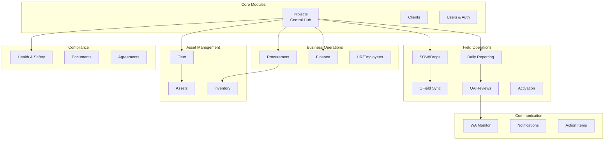
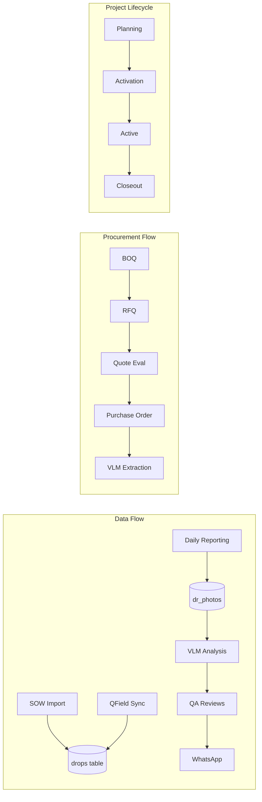
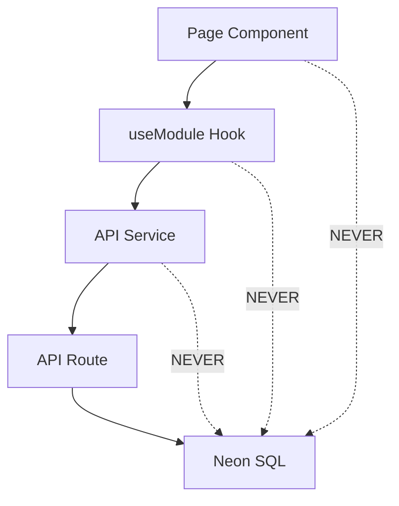

# FibreFlow Module Architecture

## Module Overview

FibreFlow uses a modular architecture with 38+ feature modules. Each module is self-contained with its own components, services, hooks, and types.



## Module Directory Structure

Each module follows this standard structure:

```
src/modules/{module-name}/
├── components/           # React components
│   ├── index.ts         # Barrel export (use carefully!)
│   └── *.tsx            # Component files
├── hooks/               # React Query hooks
│   └── use{Module}.ts
├── services/            # API services
│   └── {module}Service.ts
├── types/               # TypeScript types
│   └── {module}.types.ts
└── index.ts             # Module entry point
```

## Module Catalog

### Core Modules

| Module | Path | Purpose | Key Dependencies |
|--------|------|---------|------------------|
| **Projects** | `src/modules/projects/` | Central project management | SOW, Finance, Procurement |
| **Clients** | `src/modules/clients/` | Client/company management | Projects |
| **Users** | `src/modules/users/` | User management & auth | RBAC |

### Field Operations

| Module | Path | Purpose | Key Dependencies |
|--------|------|---------|------------------|
| **SOW** | `src/modules/sow/` | Scope of Work management | QField, Drops |
| **QField Sync** | `src/modules/qfield-sync/` | GIS data synchronization | SOW, 1Map |
| **Daily Reporting** | `src/modules/daily-reporting/` | Field reports & photos | QA, VLM |
| **QA** | `src/modules/qa/` | Quality assurance reviews | WA Monitor |
| **Activate** | `src/modules/activate/` | Project activation wizard | VLM, Documents |

### Asset Management

| Module | Path | Purpose | Key Dependencies |
|--------|------|---------|------------------|
| **Fleet** | `src/modules/fleet/` | Vehicle management | VLM (plate reading) |
| **Assets** | `src/modules/assets/` | Equipment tracking | Barcode Scanner |
| **Inventory** | `src/modules/inventory/` | Stock management | Procurement |

### Business Operations

| Module | Path | Purpose | Key Dependencies |
|--------|------|---------|------------------|
| **Procurement** | `src/modules/procurement/` | BOQ, RFQ, PO workflow | VLM, Suppliers |
| **Finance** | `src/modules/finance/` | Financial tracking | Projects, Sage |
| **HR** | `src/modules/hr/` | Employee management | Users |
| **Timesheets** | `src/modules/timesheets/` | Time tracking | Projects, Users |

### Communication

| Module | Path | Purpose | Key Dependencies |
|--------|------|---------|------------------|
| **WA Monitor** | `src/modules/wa-monitor/` | WhatsApp integration | VPS Services |
| **Notifications** | `src/modules/notifications/` | Alert system | All modules |
| **Action Items** | `src/modules/action-items/` | Task tracking | Projects |

### Compliance & Documents

| Module | Path | Purpose | Key Dependencies |
|--------|------|---------|------------------|
| **Health & Safety** | `src/modules/health-safety/` | H&S audits & compliance | Projects, Documents |
| **Documents** | `src/modules/documents/` | Document management | Firebase Storage |
| **Agreements** | `src/modules/agreements/` | Contract management | Projects, Clients |
| **Wayleaves** | `src/modules/wayleaves/` | Property access permits | Projects, 1Map |

## Module Relationships



## Critical Import Rules

### Barrel Export Warning

**Problem**: Barrel exports (`index.ts`) can cause server-only code to be bundled into client components.

```typescript
// DANGEROUS - pulls in entire module including server code
import { FinanceDashboardTab } from '@/modules/projects/components/finance';

// SAFE - direct import only gets what you need
import { FinanceDashboardTab } from '@/modules/projects/components/finance/FinanceDashboardTab';
```

### Module Import Hierarchy



**Rule**: Client-side code (pages, components, hooks, services) must NEVER import Neon directly. All database access goes through API routes.

## Module Documentation

Each module has detailed documentation in `.claude/modules/`:

```bash
ls .claude/modules/
# activate.md, agreements.md, assets.md, ...
```

See `.claude/modules/_index.yaml` for the complete registry.
