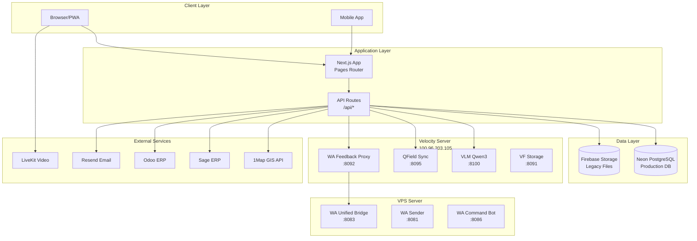
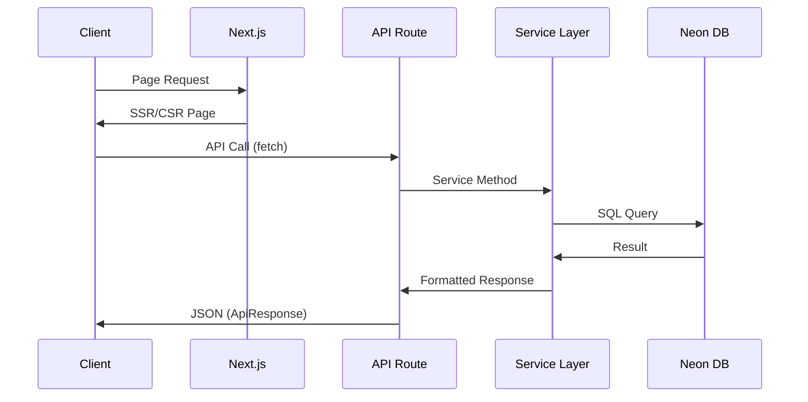

# FibreFlow System Architecture

## High-Level Overview

## Request Flow

## Key Infrastructure

| Component | Location | Port | Purpose |
|-----------|----------|------|---------|
| Next.js App | Velocity | 3000/3005/3006 | Main application |
| Neon PostgreSQL | Cloud | - | Primary database |
| VLM (Qwen3) | Velocity | 8100 | AI photo analysis |
| QField Sync | Velocity | 8095 | GIS sync webhook |
| WA Unified | VPS | 8083 | WhatsApp messaging |
| WA Sender | VPS | 8081 | Message sending |
| WA Command Bot | VPS | 8086 | Admin commands |

## Technology Stack

- **Frontend**: React 18, Next.js 14, TailwindCSS, Radix UI
- **State**: React Query (server), Zustand (client)
- **Database**: Neon PostgreSQL (serverless)
- **Auth**: Custom PostgreSQL-based (roles, permissions)
- **AI/ML**: Qwen3 VLM for photo extraction
- **Real-time**: LiveKit (video), HTTP polling (WhatsApp)
