---
pdf_options:
  format: A4
  margin:
    top: 25mm
    bottom: 25mm
    left: 20mm
    right: 20mm
  displayHeaderFooter: true
  headerTemplate: |-
    <style>
      section { width: 100%; font-family: 'IBM Plex Sans', Helvetica, Arial, sans-serif; font-size: 8px; color: #666; padding: 0 20mm; }
      .header-line { border-bottom: 2px solid #219ebc; padding-bottom: 4px; display: flex; justify-content: space-between; }
    </style>
    <section>
      <div class="header-line">
        <span style="color: #023047; font-weight: 600;">VELOCITY FIBRE</span>
        <span>FibreFlow — Complete User Manual v1.0</span>
      </div>
    </section>
  footerTemplate: |-
    <style>
      section { width: 100%; font-family: 'IBM Plex Sans', Helvetica, Arial, sans-serif; font-size: 8px; color: #666; padding: 0 20mm; }
      .footer-line { border-top: 1px solid #219ebc; padding-top: 4px; display: flex; justify-content: space-between; }
    </style>
    <section>
      <div class="footer-line">
        <span>Confidential — Velocity Fibre (Pty) Ltd</span>
        <span>Page <span class="pageNumber"></span> of <span class="totalPages"></span></span>
      </div>
    </section>
body_class: velocity-manual
css: |-
  :root {
    --vf-navy: #023047;
    --vf-blue: #1e73be;
    --vf-teal: #219ebc;
    --vf-sky: #2ea3f2;
    --vf-dark: #0e0c19;
    --vf-body: #3c3a47;
    --vf-gray-bg: #f9f9f9;
    --vf-light-border: #e0e0e0;
    --vf-red-accent: #8b2346;
  }
  @import url('https://fonts.googleapis.com/css2?family=IBM+Plex+Sans:wght@400;500;600;700&family=IBM+Plex+Sans+Condensed:wght@400;500;600&display=swap');
  body {
    font-family: 'IBM Plex Sans', Helvetica, Arial, sans-serif;
    color: var(--vf-body);
    line-height: 1.6;
    font-size: 11pt;
  }
  .cover-page {
    page-break-after: always;
    display: flex;
    flex-direction: column;
    justify-content: center;
    align-items: center;
    min-height: 85vh;
    text-align: center;
    padding: 40px;
  }
  .cover-page img { width: 220px; margin-bottom: 40px; }
  .cover-title {
    font-family: 'IBM Plex Sans Condensed', Helvetica, Arial, sans-serif;
    font-size: 36pt; font-weight: 500; color: var(--vf-navy);
    margin: 0 0 8px 0; line-height: 1.2;
  }
  .cover-subtitle {
    font-size: 16pt; color: var(--vf-teal); font-weight: 500;
    margin: 0 0 40px 0; letter-spacing: 1px;
  }
  .cover-divider {
    width: 80px; height: 3px;
    background: linear-gradient(90deg, var(--vf-navy), var(--vf-teal));
    margin: 0 auto 40px; border: none;
  }
  .cover-meta { font-size: 10pt; color: #666; line-height: 2; }
  .cover-meta strong { color: var(--vf-navy); }
  .cover-footer {
    margin-top: 60px; padding-top: 20px;
    border-top: 2px solid var(--vf-teal);
    font-size: 9pt; color: #999;
  }
  h1 {
    font-family: 'IBM Plex Sans Condensed', Helvetica, Arial, sans-serif;
    font-size: 26pt; font-weight: 500; color: var(--vf-navy);
    border-bottom: 3px solid var(--vf-teal); padding-bottom: 8px; margin-top: 40px;
  }
  h2 {
    font-family: 'IBM Plex Sans Condensed', Helvetica, Arial, sans-serif;
    font-size: 18pt; font-weight: 500; color: var(--vf-navy);
    border-bottom: 2px solid var(--vf-teal); padding-bottom: 6px;
    margin-top: 30px; page-break-after: avoid;
  }
  h3 {
    font-family: 'IBM Plex Sans', Helvetica, Arial, sans-serif;
    font-size: 13pt; font-weight: 600; color: var(--vf-navy);
    margin-top: 20px; page-break-after: avoid;
  }
  h4 {
    font-family: 'IBM Plex Sans', Helvetica, Arial, sans-serif;
    font-size: 11pt; font-weight: 600; color: var(--vf-teal);
    text-transform: uppercase; letter-spacing: 0.5px;
  }
  table {
    width: 100%; border-collapse: collapse; margin: 16px 0;
    font-size: 10pt; page-break-inside: avoid;
  }
  thead th {
    background-color: var(--vf-navy); color: white; font-weight: 600;
    padding: 10px 12px; text-align: left; font-size: 9.5pt;
  }
  tbody td { padding: 8px 12px; border-bottom: 1px solid var(--vf-light-border); }
  tbody tr:nth-child(even) { background-color: var(--vf-gray-bg); }
  blockquote {
    border-left: 4px solid var(--vf-teal); background-color: #f0f9fb;
    padding: 12px 16px; margin: 16px 0; border-radius: 0 6px 6px 0;
    font-size: 10pt; page-break-inside: avoid;
  }
  blockquote strong { color: var(--vf-navy); }
  code {
    background-color: var(--vf-gray-bg); padding: 2px 6px;
    border-radius: 3px; font-size: 9.5pt; color: var(--vf-navy);
  }
  pre {
    background-color: var(--vf-navy); color: #e0e0e0; padding: 16px;
    border-radius: 6px; font-size: 9pt; overflow-x: auto; page-break-inside: avoid;
  }
  pre code { background: none; color: inherit; padding: 0; }
  img {
    max-width: 100%; border: 1px solid var(--vf-light-border);
    border-radius: 6px; box-shadow: 0 2px 8px rgba(2, 48, 71, 0.1);
    margin: 16px 0; page-break-inside: avoid;
  }
  img + br + em, p > em:only-child {
    display: block; text-align: center; font-size: 9pt; color: #666;
    margin-top: -8px; margin-bottom: 16px;
  }
  a { color: var(--vf-blue); text-decoration: none; }
  a:hover { text-decoration: underline; }
  ul, ol { margin: 8px 0; padding-left: 24px; }
  li { margin-bottom: 4px; }
  li strong { color: var(--vf-navy); }
  hr { border: none; height: 2px; background: linear-gradient(90deg, var(--vf-teal), transparent); margin: 30px 0; }
  h2#table-of-contents + ol, h2 + ol {
    background: var(--vf-gray-bg); padding: 20px 20px 20px 40px;
    border-radius: 6px; border-left: 4px solid var(--vf-navy);
  }
  strong { font-weight: 600; }
  @media print {
    body { font-size: 10.5pt; }
    h1 { font-size: 24pt; }
    h2 { font-size: 16pt; }
    h3 { font-size: 12pt; }
    img { max-height: 400px; object-fit: contain; }
  }
---

<div class="cover-page">


<div class="cover-title">FibreFlow</div>
<div class="cover-subtitle">COMPLETE USER MANUAL</div>

<hr class="cover-divider" />

<div class="cover-meta">
<strong>Version:</strong> 1.0<br/>
<strong>Last Updated:</strong> 31 January 2026<br/>
<strong>Application:</strong> FibreFlow (fibreflow.app)<br/>
<strong>Scope:</strong> All Modules<br/>
<strong>Classification:</strong> Internal Use
</div>

<div class="cover-footer">
Velocity Fibre (Pty) Ltd — Connecting Communities, Empowering Futures
</div>

</div>

# FibreFlow — Complete User Manual

## Table of Contents

1. [Getting Started](#1-getting-started)
2. [Main — Dashboard, Meetings & Action Items](#2-main--dashboard-meetings--action-items)
3. [Project Management](#3-project-management)
4. [Activate — QA & Photo Review](#4-activate--qa--photo-review)
5. [Maintenance](#5-maintenance)
6. [Procurement](#6-procurement)
7. [Assets](#7-assets)
8. [Fleet Management](#8-fleet-management)
9. [Human Resources](#9-human-resources)
10. [Analytics](#10-analytics)
11. [Communications](#11-communications)
12. [System Administration](#12-system-administration)
13. [Appendices](#13-appendices)

---

## How to Use This Manual

This manual covers every module in FibreFlow, organized by the sidebar navigation sections. Each chapter includes:

- **Overview** — What the module does and who uses it
- **Navigation** — How to reach the module from the sidebar
- **Features** — Detailed walkthrough of each feature with screenshots
- **Workflows** — Step-by-step procedures for common tasks
- **Troubleshooting** — Solutions for common issues

**Conventions used in this manual:**

| Convention | Meaning |
|------------|---------|
| **Bold text** | UI element names (buttons, tabs, labels) |
| `Code text` | Technical values, field names, or system identifiers |
| > **Tip:** | Helpful shortcut or best practice |
| > **Important:** | Critical information — read carefully |
| *Italic text* | Figure captions below screenshots |

**Role Badges:** Where features are restricted by role, you will see tags like **(Admin only)** or **(Manager+)**.

---

## 1. Getting Started

### 1.1 Accessing FibreFlow

FibreFlow is a web application accessible from any modern browser (Chrome, Firefox, Edge, Safari).

| Environment | URL | Purpose |
|-------------|-----|---------|
| **Production** | app.fibreflow.app | Live system for daily use |
| **Staging** | vf.fibreflow.app | Pre-release testing |
| **Development** | dev.fibreflow.app | Feature development |

1. Open your browser and navigate to **app.fibreflow.app**
2. Enter your email address and password
3. Click **Sign In**
4. You will be redirected to the Dashboard


*Figure 1.1: FibreFlow login page*

> **Tip:** If you forget your password, contact your system administrator to reset it.

### 1.2 The FibreFlow Interface

After logging in, you will see the main interface consisting of:

- **Sidebar** (left) — Navigation menu organized into sections
- **Header** (top) — Search bar, notifications, user menu, dark mode toggle
- **Content Area** (center) — The active page content
- **Tabs** (within modules) — Horizontal tab navigation within each module

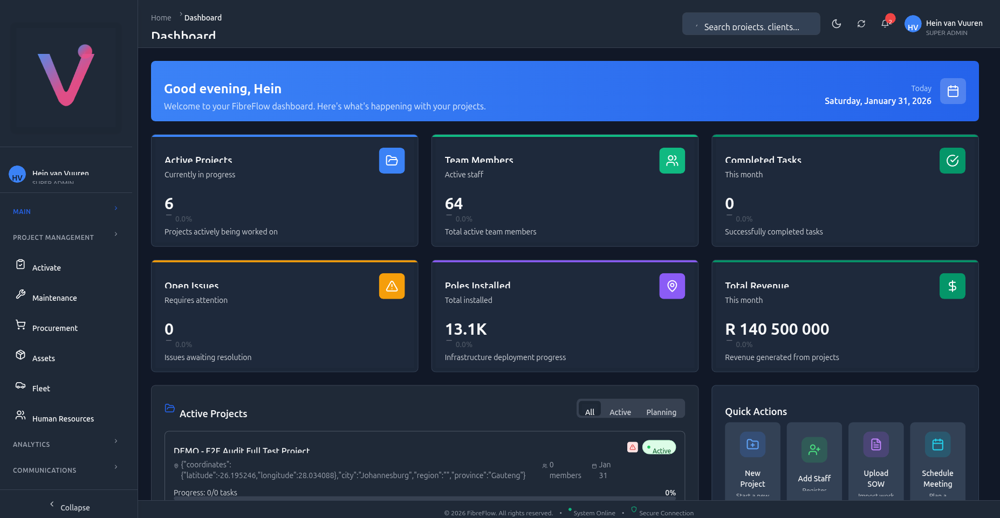
*Figure 1.2: FibreFlow main interface showing sidebar, header, and content area*

### 1.3 Navigation Structure

The sidebar is organized into **11 sections**, each representing a major area of the application:

| Section | Icon | Purpose |
|---------|------|---------|
| **Main** | Home | Dashboard, Meetings, Action Items |
| **Project Management** | Folder | Projects, Clients, Contractors |
| **Activate** | CheckCircle | QA photo review and DR processing |
| **Maintenance** | Wrench | Maintenance ticket management |
| **Procurement** | ShoppingCart | BOQ, RFQ, PO, inventory |
| **Assets** | Package | Equipment and asset tracking |
| **Fleet** | Truck | Vehicle and driver management |
| **Human Resources** | Users | Staff directory and compliance |
| **Analytics** | BarChart | KPIs, reports, dashboards |
| **Communications** | MessageSquare | WhatsApp, meetings, notifications |
| **System** | Settings | Admin tools, data sync, settings |

Click a section header to expand or collapse it. Sections with a direct link (like Activate or Maintenance) navigate directly to that module.

### 1.4 User Roles & Permissions

FibreFlow uses Role-Based Access Control (RBAC). Your role determines which modules, pages, and actions you can access.

| Role | Description | Typical Access |
|------|-------------|---------------|
| **Super Admin** | Full system control | Everything — all modules, settings, system admin |
| **Admin** | Organization admin | All modules except system internals |
| **Manager** | Department/project lead | Projects, procurement, reports, team management |
| **Technician** | Field worker | Assigned tasks, check-ins, limited views |
| **Viewer** | Read-only observer | View dashboards and reports, no edit access |
| **Contractor** | External partner | Contractor portal, assigned project views |

> **Important:** If you cannot see a menu item or feature described in this manual, your role may not have access. Contact your administrator to request additional permissions.

### 1.5 Common UI Patterns

FibreFlow uses consistent patterns across all modules:

**Search Bars** — Type to filter lists in real time. Most search bars filter across multiple fields (name, ID, description).

**Filters** — Dropdown or toggle filters to narrow results by status, date, category, or other criteria.

**Tab Navigation** — Horizontal tabs within modules let you switch between sub-sections without leaving the page.

**Modal Dialogs** — Forms and details often open in overlay modals. Click outside or press Escape to close.

**Toast Notifications** — Success/error messages appear briefly in the corner of the screen.

**Dark Mode** — Toggle dark mode from the header menu (user icon → Theme toggle). All modules support dark mode.

---

## 2. Main — Dashboard, Meetings & Action Items

### 2.1 Dashboard

The Dashboard is your landing page after login. It provides a high-level overview of your organization's operations.

**Navigation:** Sidebar → **Main** → **Dashboard** (or click the FibreFlow logo)


*Figure 2.1: Main Dashboard showing project overview cards, activity feed, and quick actions*

#### Statistics Cards

The top row displays key metrics:

| Card | Description |
|------|-------------|
| **Active Projects** | Number of currently active projects |
| **Total Staff** | Number of staff members in the system |
| **Open Tickets** | Maintenance tickets requiring attention |
| **Pending QA** | Activate reviews waiting for QA processing |

#### Project Overview

A grid of project cards showing each project's:
- Name and client
- Status (Active, Planning, On Hold, Completed)
- Progress percentage
- Key dates

#### Recent Activity Feed

A chronological stream of recent actions across the system — ticket updates, project changes, new submissions, and more.

#### Quick Actions

Shortcut buttons for common tasks:
- **Create Project** — Start a new project
- **Create Ticket** — Open a maintenance ticket
- **Import SOW** — Upload a Scope of Work document
- **View Reports** — Navigate to analytics

### 2.2 Meetings

The Meetings module integrates with Fireflies.ai to automatically sync meeting transcripts, summaries, and action items.

**Navigation:** Sidebar → **Main** → **Meetings**

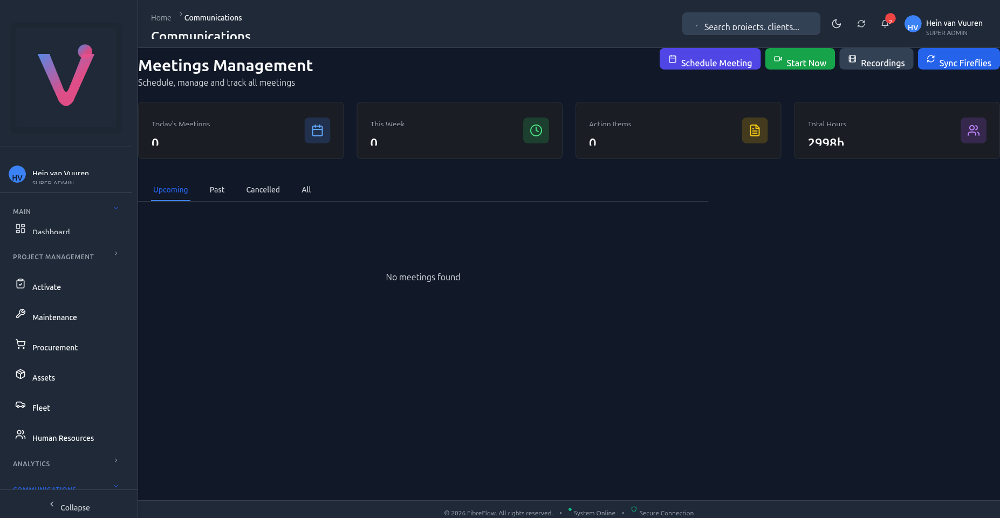
*Figure 2.2: Meetings page showing synced transcripts with search and date filters*

#### Features

- **Auto-sync** — Meetings from Fireflies.ai are automatically synced to FibreFlow
- **Manual sync** — Click **Sync Now** to pull the latest transcripts
- **Meeting detail** — Click any meeting to view:
  - Full transcript
  - AI-generated summary with key points
  - Action items extracted from the meeting
  - Participants list
  - Duration and date

#### Meeting Detail Modal

| Section | Content |
|---------|---------|
| **Summary** | AI-generated meeting summary |
| **Keywords** | Key topics discussed |
| **Action Items** | Tasks identified from the conversation |
| **Outline** | Structured breakdown of the meeting |
| **Participants** | List of attendees |

### 2.3 Action Items

Track tasks and follow-ups that come out of meetings, projects, or ad-hoc assignments.

**Navigation:** Sidebar → **Main** → **Action Items**

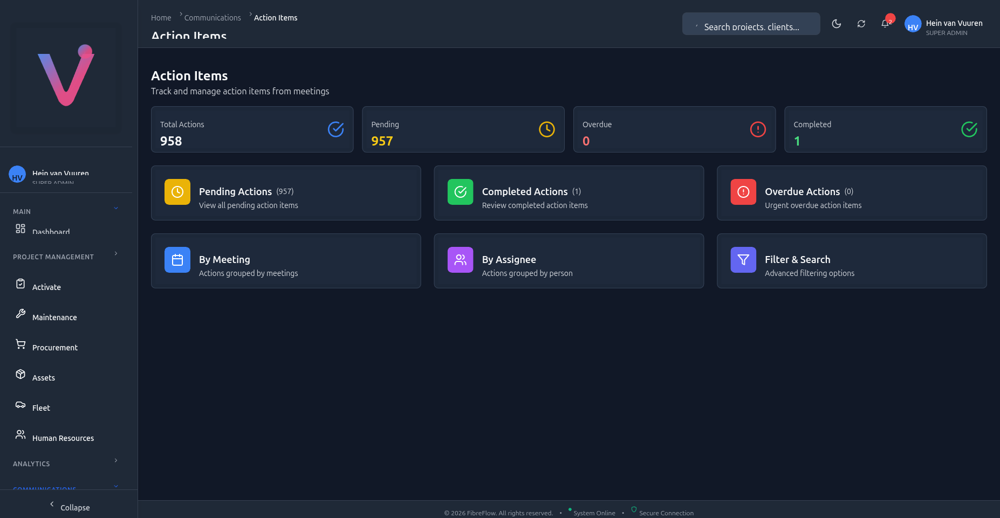
*Figure 2.3: Action Items list with status filters and assignee tracking*

#### Features

- **Create** — Add new action items with title, description, assignee, and due date
- **Filter** — Filter by status (Open, In Progress, Completed) or assignee
- **Track** — Monitor progress with status updates and due date tracking
- **Link** — Action items can be linked to meetings or projects

---

## 3. Project Management

### 3.1 Projects List

The Projects module is the core of FibreFlow, managing fiber network deployment projects from planning through completion.

**Navigation:** Sidebar → **Project Management** → **Projects**

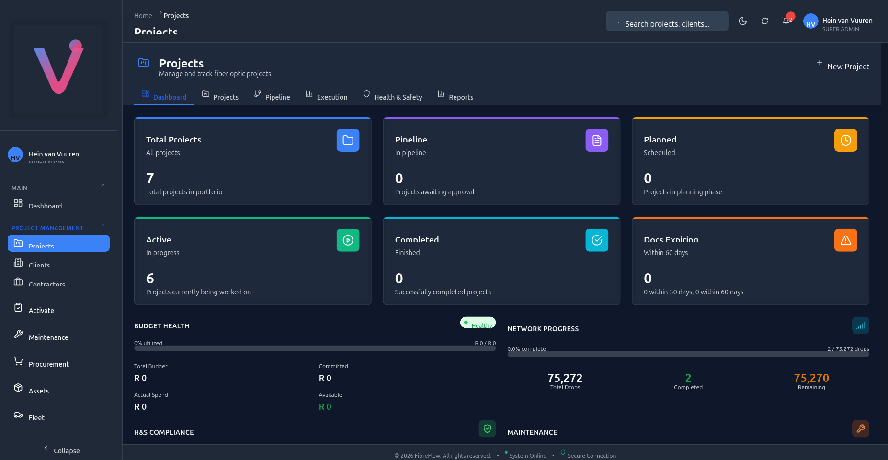
*Figure 3.1: Projects list showing active projects with status, progress, and quick filters*

#### Views

- **Grid View** — Card-based layout showing project cards with key metrics
- **List View** — Table layout with sortable columns

#### Filters

| Filter | Options |
|--------|---------|
| **Status** | All, Active, Planning, On Hold, Completed |
| **Search** | Search by project name, code, or client |
| **Sort** | Name, Date Created, Status, Progress |

#### Creating a New Project

1. Click **+ New Project** (top-right)
2. Fill in the required fields:
   - **Project Name** — Descriptive name
   - **Client** — Select from client list
   - **Project Code** — Auto-generated or manual
   - **Status** — Default: Planning
   - **Start Date** and **Target End Date**
3. Click **Save**

### 3.2 Project Detail

Click any project to view its detail page with comprehensive tabs.

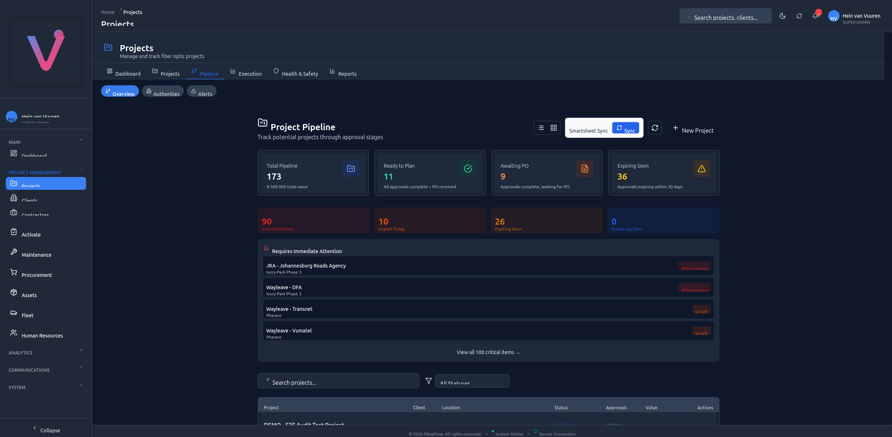
*Figure 3.2: Project detail page showing overview tab with team, timeline, and key metrics*

#### Tabs

| Tab | Content |
|-----|---------|
| **Overview** | Project info, status, progress, key metrics |
| **Team** | Assigned staff and contractors with roles |
| **Timeline** | Activity timeline and milestones |
| **Procurement** | BOQ, RFQ, PO summary for this project |
| **Health & Safety** | H&S compliance, incidents, checklists |
| **Reports** | Project-specific reports |

#### Team Management

The Team tab shows a unified view of all team members (staff and contractors):
- **Primary Manager** — The project lead (marked with star icon)
- **Team Members** — Staff assigned to this project
- **Contractors** — External contractors working on the project
- Add/remove members using the **+ Add Member** button

### 3.3 Pipeline

The Pipeline module tracks project progression through pre-construction phases — from initial proposal to construction readiness.

**Navigation:** Sidebar → **Project Management** → **Projects** → **Pipeline** tab

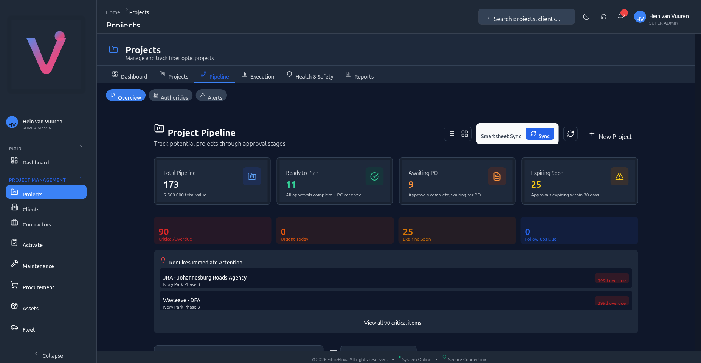
*Figure 3.3: Pipeline view showing projects across approval stages*

#### Sub-tabs

| Tab | Purpose |
|-----|---------|
| **Overview** | Pipeline stages and project positioning |
| **Authorities** | Service authority management and approvals |
| **Alerts** | Pipeline alerts and blockers |

#### Pipeline Stages

Projects move through defined stages:
1. **Proposal** — Initial project proposal
2. **Due Diligence** — Feasibility study and site surveys
3. **Approvals** — Municipal and authority approvals
4. **Design** — Network design and engineering
5. **Ready for Construction** — All approvals received

#### Authorities

Manage service authorities required for each project:
- Add authority requirements (municipal, environmental, utility)
- Track submission and approval status
- Upload supporting documents
- Set expiry dates

### 3.4 Execution & Progress

Track daily progress and manage project tasks during the construction phase.

**Navigation:** Sidebar → **Project Management** → **Projects** → **Execution** tab

#### Progress Reports

- View daily progress entries by project
- Track meters of fiber installed, poles erected, drops connected
- Compare planned vs actual progress

#### Tasks

- Create and assign project tasks
- Set priorities and due dates
- Track task completion status

### 3.5 Health & Safety

Manage health and safety compliance for each project.

**Navigation:** Sidebar → **Project Management** → **Projects** → **Health & Safety** tab

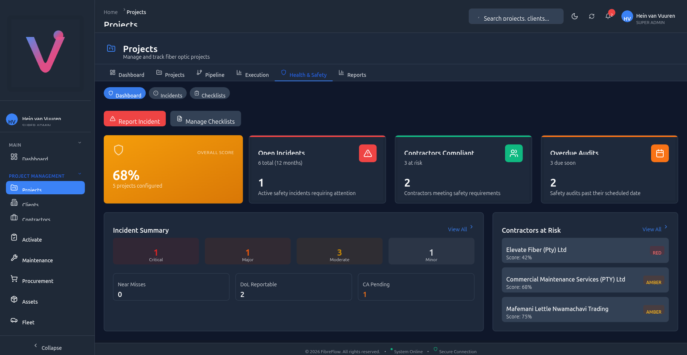
*Figure 3.4: Health & Safety dashboard showing incident tracking and compliance scores*

#### Sub-tabs

| Tab | Purpose |
|-----|---------|
| **Dashboard** | H&S compliance overview and statistics |
| **Incidents** | Record and track safety incidents |
| **Checklists** | Safety inspection checklists |

#### Incident Management

- Record incidents with type, severity, date, and description
- Attach photos and documents
- Track investigation status and corrective actions
- View incident trends over time

### 3.6 Clients

Manage client organizations associated with your fiber projects.

**Navigation:** Sidebar → **Project Management** → **Clients**

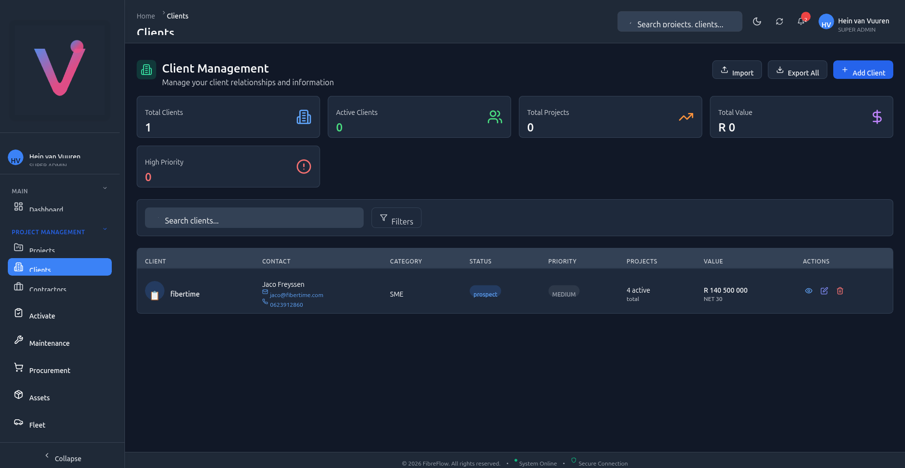
*Figure 3.5: Clients list showing organization details and project counts*

#### Features

- **Client List** — View all clients with search and status filters
- **Client Detail** — Click to view full details including:
  - Contact information (name, phone, email, address)
  - Associated projects
  - Financial summary (total revenue)
  - Notes and communications history
- **Create Client** — Add new client organizations
- **Edit/Delete** — Manage existing client records

### 3.7 Contractors

Manage external contractors and their performance.

**Navigation:** Sidebar → **Project Management** → **Contractors**

#### Features

- **Contractor Portal** — List of all contractors with project assignments
- **RAG Dashboard** — Red/Amber/Green performance ratings:
  - **Red** — Significant issues, action required
  - **Amber** — Minor issues, monitor closely
  - **Green** — Performing well
- **Document Reports** — Track contractor document compliance (insurance, licenses, etc.)

### 3.8 Reports

Project-level reporting and analytics.

**Navigation:** Sidebar → **Project Management** → **Projects** → **Reports** tab

- Project progress reports
- Timeline adherence tracking
- Budget vs actual spending
- Resource utilization reports

---

## 4. Activate — QA & Photo Review

The Activate module is FibreFlow's AI-powered quality assurance system for verifying field installations through photo review.

### 4.1 Dashboard

**Navigation:** Sidebar → **Activate** (click section header)

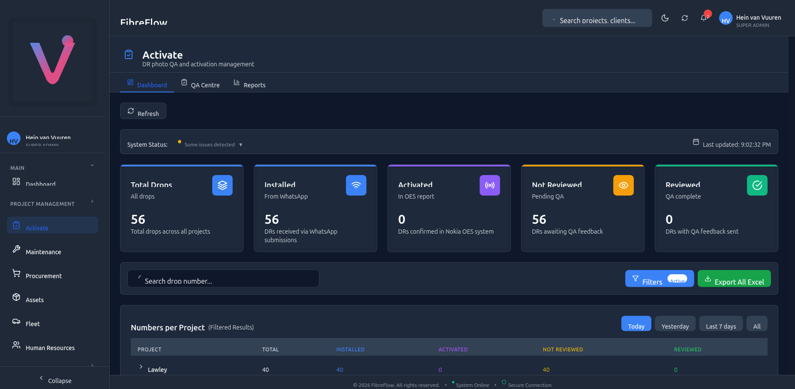
*Figure 4.1: Activate Dashboard showing QA statistics, project filter, and drop counts by status*

#### Statistics Cards

| Card | Description |
|------|-------------|
| **Total DRs** | Total drop reference numbers in the system |
| **Pending QA** | DRs awaiting quality review |
| **Passed** | DRs that passed QA review |
| **Failed** | DRs that failed QA review |
| **Rework** | DRs sent back for corrections |

#### Project Filter

Select a specific project to filter the dashboard data, or view across all projects.

### 4.2 QA Centre

The QA Centre is the main workspace for reviewing field installation photos.

**Navigation:** Sidebar → **Activate** → **QA Centre** tab

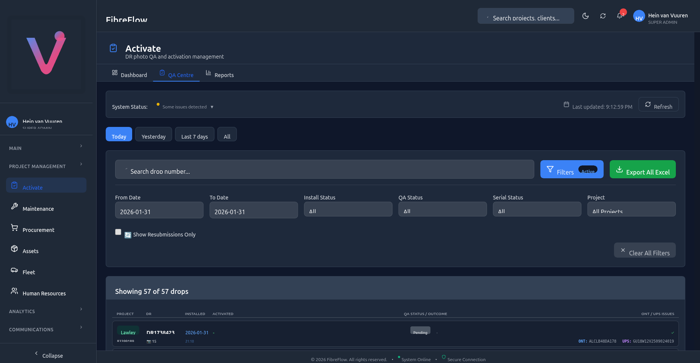
*Figure 4.2: QA Centre showing DR list with status badges, search, and filter options*

#### DR List

A searchable, filterable list of all drop reference numbers (DRs):

| Column | Description |
|--------|-------------|
| **DR Number** | Unique drop reference (e.g., DR1738371) |
| **Project** | Associated project name |
| **Status** | QA status badge (Pending, Passed, Failed, Rework) |
| **Photos** | Number of photos available |
| **Submitted** | Date the DR was submitted for review |
| **Reviewed** | Date of last QA review |

#### Search & Filters

- **Search** — Find DRs by number, project, or installer name
- **Status Filter** — Pending, Passed, Failed, Rework, All
- **Project Filter** — Filter by specific project
- **Date Range** — Filter by submission date

### 4.3 QA Wizard — 5-Phase Review

Click any DR to open the QA Wizard — a guided 5-phase review process.

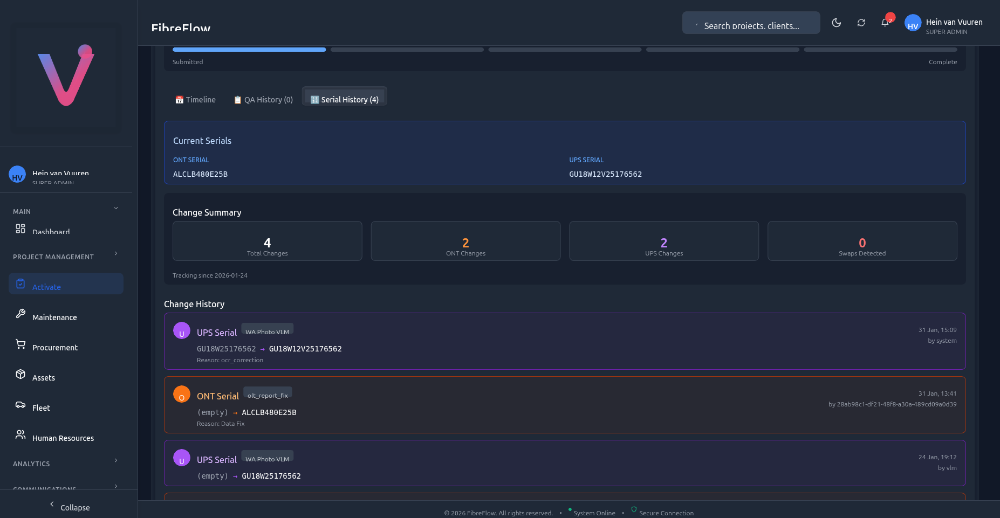
*Figure 4.3: QA Wizard showing the photo review phase with categorized installation photos*

#### Phase 1: Prerequisites

Validates that the DR has sufficient data for review:
- Minimum photo count met
- Photos have been AI-categorized
- OES data available
- Contact information present

#### Phase 2: Photo Review

Review installation photos mapped to a 10-step checklist:

| Step | Label | What to Check |
|------|-------|---------------|
| 1 | House Photo | Property correctly identified |
| 2 | Cable from Pole | Cable routed properly from pole |
| 3 | Entry Outside | External cable entry point |
| 4 | Entry Inside | Internal cable entry point |
| 5 | Wall | Wall mount installation |
| 6 | ONT Back | ONT device installed correctly |
| 7 | Power Meter | Signal strength reading (-18 to -24 dBm) |
| 8 | Final Installation | Completed installation overview |
| 9 | Green Lights | ONT LED indicators showing green |
| 10 | Signature | Customer sign-off obtained |

For each step:
- View the assigned photo(s)
- Approve or flag issues
- Re-assign photos to different steps if AI categorization was incorrect

#### Phase 3: Data Validation

Validates extracted data:
- **Power meter reading** — Must be between -18 and -24 dBm
- **ONT serial** — Extracted serial matches expected format (ALCL prefix)
- **DR number** — Matches the submission

#### Phase 4: Final Decision

Make the QA decision:

| Decision | Action | Result |
|----------|--------|--------|
| **Pass** | Installation meets all requirements | DR marked as approved |
| **Fail** | Critical issues found | DR marked as failed with reason codes |
| **Rework Needed** | Minor issues to fix | DR sent back to installer with feedback |

Select a reason code when failing or requesting rework:
- Missing photos
- Poor photo quality
- Installation defect
- Serial mismatch
- Signal out of range

#### Phase 5: Feedback

Generate and send feedback to the field installer:
- Auto-generated feedback message based on decision and reason codes
- Sent via WhatsApp to the installer
- Includes specific issues to address
- Tracks acknowledgment status

### 4.4 VLM AI Integration

FibreFlow uses a Vision Language Model (VLM) — Qwen3-VL — to automatically process installation photos:

- **Auto-categorization** — Photos are categorized to the 10-step checklist
- **Serial Extraction** — ONT serial numbers are read from photos
- **Power Reading** — dBm values extracted from power meter photos
- **DR Detection** — DR numbers identified from labels

> **Tip:** AI categorization is a starting point — always verify and correct during the Photo Review phase. Your corrections are saved and improve future AI accuracy through few-shot learning.

### 4.5 Reports

**Navigation:** Sidebar → **Activate** → **Reports** tab

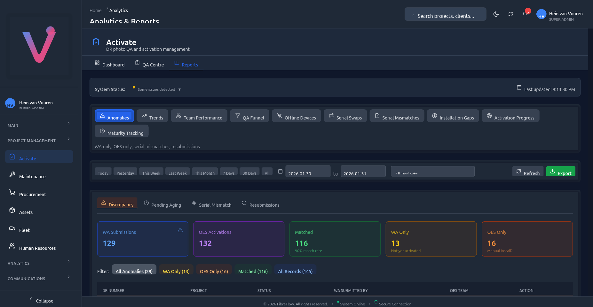
*Figure 4.4: Activate Reports dashboard showing trend analysis and performance metrics*

Available report types:

| Report | Description |
|--------|-------------|
| **Trends** | QA pass/fail rates over time |
| **Funnel** | DR progression through QA stages |
| **Team Performance** | Reviewer throughput and accuracy |
| **Serial Validation** | ONT serial match rates |
| **Offline Devices** | Installations with connectivity issues |
| **Serial Mismatch** | DRs where serial numbers do not match expected |
| **Installation Gaps** | Missing checklist steps |
| **Anomaly Detection** | Unusual patterns in submissions |

All reports support:
- Date range filtering
- Project filtering
- CSV export

### 4.6 OES Import & Data Sync

**(Admin only)**

- **OES Import** — Import OES (Operation Engineering Support) activation data from Excel files
- **SharePoint Sync** — Synchronize DR data from SharePoint document libraries
- **QField Sync** — Push OES coordinate data to QField for field mapping

---

## 5. Maintenance

The Maintenance module manages the complete lifecycle of fiber network maintenance tickets.

> **Note:** A comprehensive standalone Maintenance manual is available with detailed coverage of all features. This chapter provides an overview — see the dedicated **FibreFlow Maintenance Module User Manual** for in-depth documentation.

### 5.1 Dashboard

**Navigation:** Sidebar → **Maintenance** (click section header)

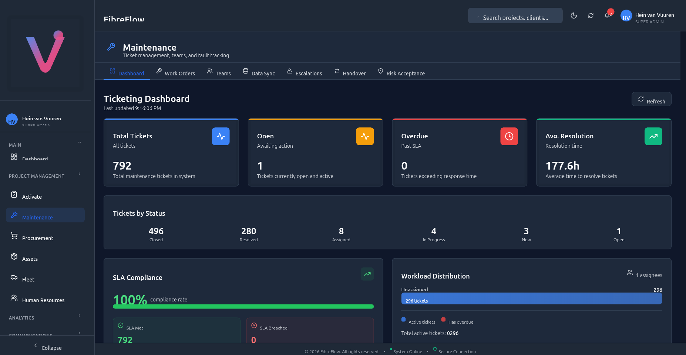
*Figure 5.1: Maintenance Dashboard showing ticket statistics, SLA compliance, and workload*

#### Key Metrics

| Metric | Description |
|--------|-------------|
| **Total Tickets** | All maintenance tickets |
| **Open** | Tickets awaiting action |
| **Overdue** | Tickets exceeding SLA target |
| **Avg. Resolution** | Average resolution time |
| **SLA Compliance** | Percentage meeting response targets |

### 5.2 Work Orders — Kanban Board

The primary ticket management view with drag-and-drop columns.

**Navigation:** Sidebar → **Maintenance** → **Work Orders** tab

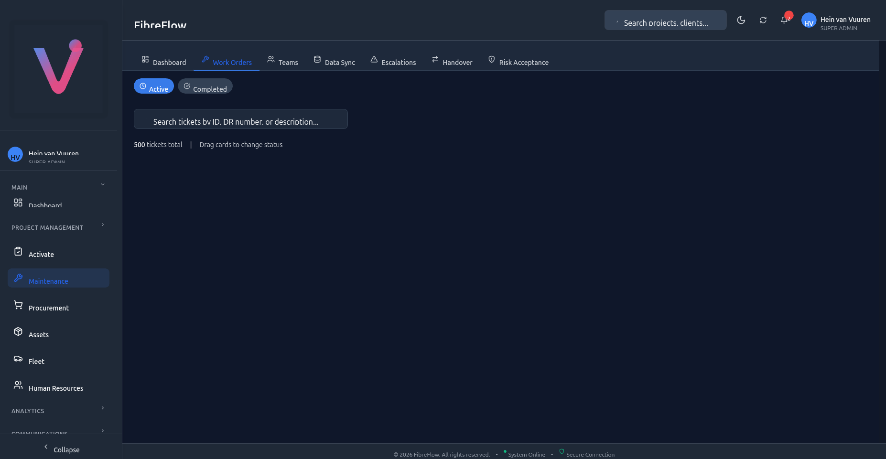
*Figure 5.2: Maintenance Kanban Board with tickets organized by status columns*

#### Columns

| Column | Description |
|--------|-------------|
| **New** | Newly created tickets |
| **Triaged** | Assessed and categorized |
| **Assigned** | Assigned to a technician |
| **In Progress** | Work actively underway |
| **Blocked** | Blocked by an external issue |
| **Resolved** | Work completed |
| **Closed** | Ticket fully closed |

#### Ticket Lifecycle

```
NEW → ASSIGNED → IN_PROGRESS → PENDING_QA → QA_APPROVED → CLOSED
                                    ↓
                              QA_REJECTED → back to IN_PROGRESS
```

### 5.3 Key Features Summary

| Feature | Description | See Standalone Manual Section |
|---------|-------------|-------------------------------|
| **Ticket Creation** | Create tickets manually or via import | Section 6 |
| **Team Management** | Organize internal and contractor teams | Section 8 |
| **QContact Sync** | Bidirectional sync with FiberTime QContact CRM | Section 9 |
| **Escalations** | Automatic repeat fault detection | Section 10 |
| **Handover** | 5-gate controlled team transitions | Section 11 |
| **Risk Acceptance** | Conditional QA approvals | Section 12 |

### 5.4 SLA Targets

| Priority | SLA Target |
|----------|-----------|
| Critical | 6 hours |
| Urgent | 12 hours |
| High | 1 day |
| Normal | 3 days |
| Low | 7 days |

### 5.5 Fault Cause Attribution

Every maintenance ticket requires a fault cause — this determines contractor liability:

| Fault Cause | Contractor Liable? |
|-------------|-------------------|
| **Workmanship** | YES |
| **Material Failure** | No |
| **Client Damage** | No |
| **Third Party** | No |
| **Environmental** | No |
| **Vandalism** | No |
| **Unknown** | No |

> **Important:** Fault cause selection directly affects contractor billing. Choose accurately.

---

## 6. Procurement

The Procurement module manages the complete purchasing workflow — from Bill of Quantities through to goods receipt.

### 6.1 Dashboard

**Navigation:** Sidebar → **Procurement** (click section header)

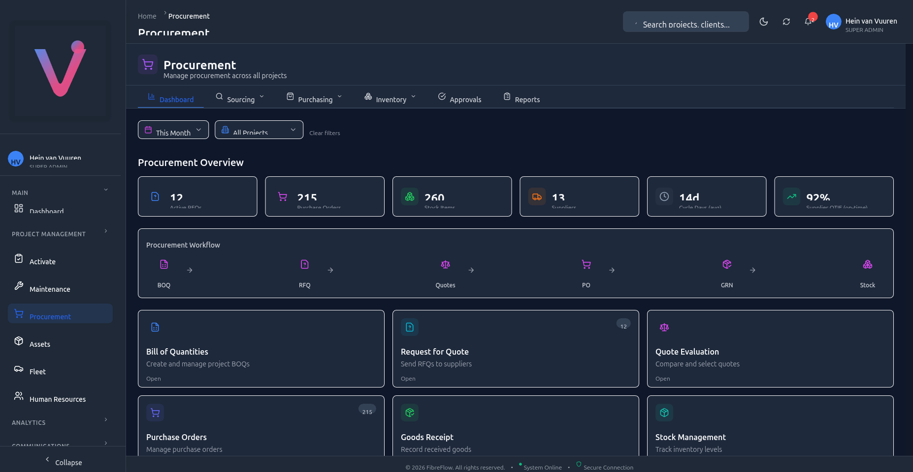
*Figure 6.1: Procurement Dashboard showing order statistics, pending approvals, and quick actions*

#### Quick Actions

- **Create BOQ** — Start a new Bill of Quantities
- **New RFQ** — Create a Request for Quotation
- **Create PO** — Generate a Purchase Order
- **View Approvals** — Check pending approval items

#### Dashboard Tabs

The procurement module uses horizontal tabs for navigation:

| Tab | Purpose |
|-----|---------|
| **Dashboard** | Overview statistics and quick actions |
| **Sourcing** | BOQ management |
| **Purchasing** | RFQ and PO management |
| **Inventory** | Stock items, movements, stock takes |
| **Financial** | Cost tracking and budget overview |
| **Approvals** | Pending approval items |

### 6.2 Sourcing — BOQ Management

The Bill of Quantities (BOQ) manages material requirements for projects.

**Navigation:** Procurement → **Sourcing** tab

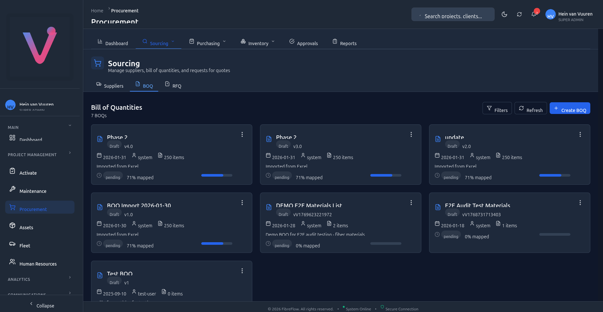
*Figure 6.2: BOQ management showing project BOQs with upload and column mapping features*

#### Creating a BOQ

1. Click **+ Create BOQ**
2. Select the **Project**
3. **Upload Excel file** — The system auto-detects columns:
   - Item description
   - Quantity
   - Unit of measure
   - Unit price
4. **Column Mapping** — Review and adjust detected columns
5. **Stock Matching** — System matches BOQ items to existing stock items using fuzzy matching
6. Review and **Confirm Import**

#### BOQ Features

- **Upload** — Import from Excel with auto-detection
- **Column Mapper** — Visual interface to map Excel columns to BOQ fields
- **Stock Matcher** — Fuzzy matching to link BOQ items to inventory
- **History** — Track BOQ revisions and changes
- **Export** — Download BOQ as Excel

### 6.3 RFQ — Request for Quotation

Send requests for quotation to suppliers and compare responses.

**Navigation:** Procurement → **Purchasing** tab → RFQ section

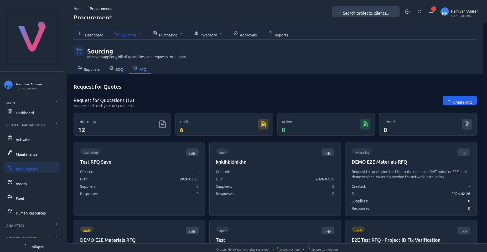
*Figure 6.3: RFQ detail page showing line items, supplier responses, and comparison view*

#### Creating an RFQ

1. Navigate to **Purchasing** tab
2. Click **+ New RFQ**
3. Fill in:
   - **Title** — RFQ description
   - **Project** — Associated project
   - **Due Date** — Response deadline
   - **Items** — Add line items (from BOQ or manual entry)
4. Select **Suppliers** to send to
5. Click **Create & Send**

#### Managing RFQ Responses

- View responses from each supplier
- Compare prices side-by-side
- Select winning quotes
- **Convert to PO** — Create a purchase order from the selected response

### 6.4 Purchase Orders

Create and manage purchase orders with approval workflows.

**Navigation:** Procurement → **Purchasing** tab → PO section

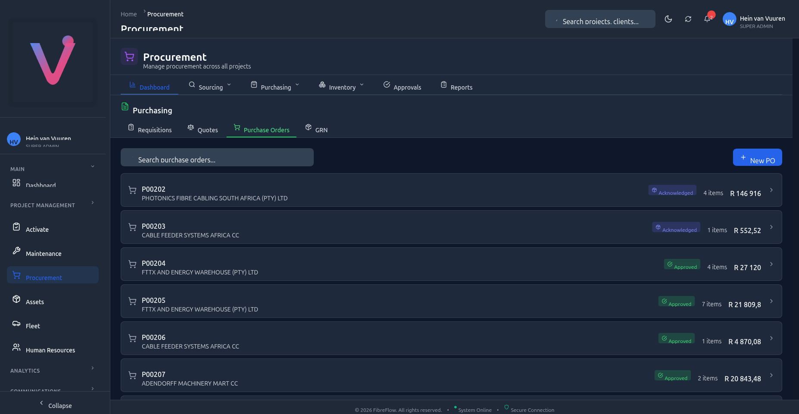
*Figure 6.4: Purchase Order detail showing line items, approval status, and version history*

#### PO Approval Workflow

Purchase orders follow an approval chain based on value thresholds:

| Value Range | Required Approval |
|-------------|------------------|
| R0 – R10,000 | Manager approval |
| R10,001 – R50,000 | Senior manager + Director |
| R50,001+ | Executive approval |

#### PO Statuses

| Status | Description |
|--------|-------------|
| **Draft** | PO being prepared |
| **Pending Approval** | Awaiting approver sign-off |
| **Approved** | Ready to send to supplier |
| **Sent** | Sent to supplier |
| **Partially Received** | Some items received |
| **Fully Received** | All items received |
| **Cancelled** | PO cancelled |

#### PO Versioning

When a PO is modified after approval, a new version is created. The version history tracks all changes with timestamps and reasons.

### 6.5 Inventory

Manage stock items, track movements, and perform stock takes.

**Navigation:** Procurement → **Inventory** tab

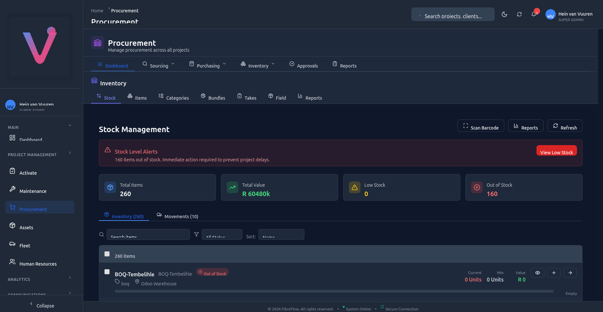
*Figure 6.5: Stock management dashboard showing items, levels, and movement history*

#### Stock Items

- View all stock items with search and category filters
- Visual stock level bars showing quantity vs max capacity
- Quick filters for **Low Stock** and **Out of Stock**
- Color-coded status indicators:
  - **Green** — Adequate stock
  - **Yellow** — Low stock (below minimum)
  - **Red** — Out of stock

#### Stock Movements

Track all inventory movements:
- **Receipts** — Items received from suppliers (GRN)
- **Issues** — Items issued to projects
- **Transfers** — Items moved between locations
- **Adjustments** — Stock count corrections

#### Goods Receipt Notes (GRN)

Record received goods against purchase orders:
1. Navigate to a PO → Click **Receive Goods**
2. Enter quantities received for each line item
3. Note any discrepancies
4. Upload delivery note/photo
5. Confirm receipt

### 6.6 Financial

Cost tracking and budget overview for procurement activities.

**Navigation:** Procurement → **Financial** tab

- Total spend by project, supplier, and category
- Budget vs actual comparison
- Outstanding payment tracking
- Cost trends over time

### 6.7 Approvals

View and action pending approvals across procurement.

**Navigation:** Procurement → **Approvals** tab

| Action | Description |
|--------|-------------|
| **Approve** | Approve the purchase order |
| **Reject** | Reject with reason |
| **Request Changes** | Send back for modifications |

### 6.8 Suppliers

Manage supplier relationships and item codes.

**Navigation:** (Accessed via Projects → Contractors or Procurement pages)

- **Supplier List** — All registered suppliers
- **Supplier Detail** — Contact info, item codes, performance
- **Item Codes** — Map supplier-specific codes to stock items
- **Performance** — On-time delivery, quality, pricing metrics

---

## 7. Assets

The Assets module provides complete asset lifecycle management for tools, equipment, and materials.

### 7.1 Dashboard

**Navigation:** Sidebar → **Assets** (click section header)


*Figure 7.1: Assets Dashboard showing total assets, available, assigned, and maintenance alerts*

#### Statistics Cards

| Card | Description |
|------|-------------|
| **Total Assets** | Total registered assets |
| **Available** | Assets ready for checkout |
| **Assigned** | Assets currently checked out |
| **In Maintenance** | Assets under repair/service |
| **Calibration Due** | Assets needing calibration |
| **Calibration Overdue** | Assets past calibration date |

### 7.2 All Assets

**Navigation:** Assets → **All Assets** tab

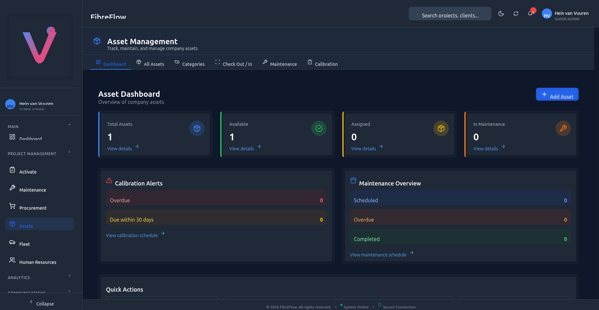
*Figure 7.2: Assets list with search, category filter, and status indicators*

#### Viewing Assets

A searchable table of all assets with:
- **Asset Number** — Unique identifier
- **Name** — Asset description
- **Category** — Classification (Tools, Electronics, Vehicles, etc.)
- **Status** — Available, Assigned, In Maintenance, Retired
- **Location** — Current location or assigned person
- **Last Calibration** — Date of last calibration check

#### Creating an Asset

1. Click **+ New Asset**
2. Fill in required fields:
   - **Name** — Asset description
   - **Category** — Select from categories
   - **Asset Number** — Auto-generated or manual
   - **Serial Number** — Manufacturer serial
   - **Purchase Date** and **Purchase Price**
   - **Location** — Storage location
3. Optionally add:
   - **Barcode** — For QR code scanning
   - **Warranty Expiry** — Warranty end date
   - **Calibration Interval** — Days between calibrations
4. Click **Save**

### 7.3 Asset Detail

Click any asset to view its full detail page:

- **Overview** — All asset information
- **Documents** — Upload and manage asset documents (manuals, certificates)
- **Maintenance History** — Past and scheduled maintenance records
- **Assignment History** — Who has checked this asset out and when
- **Verification** — VLM-powered label verification (scan asset label to verify match)

### 7.4 Categories

**Navigation:** Assets → **Categories** tab

- Create and manage asset categories (e.g., Power Tools, Fiber Optic Equipment, Safety Gear)
- Each category can have custom fields

### 7.5 Check Out / Check In

**Navigation:** Assets → **Check Out / In** tab

#### Checking Out an Asset

1. Navigate to the asset or use **Check Out / In** tab
2. Click **Check Out**
3. Select the **Person** receiving the asset
4. Add **Purpose** and **Expected Return Date**
5. Confirm

#### Checking In an Asset

1. Find the checked-out asset
2. Click **Check In**
3. Note the **Condition** on return
4. Add any **Notes** about damage or issues
5. Confirm

### 7.6 Maintenance Scheduling

**Navigation:** Assets → **Maintenance** tab

- Schedule preventive maintenance
- Track maintenance history
- Set recurring maintenance intervals
- View upcoming and overdue maintenance

### 7.7 Calibration Tracking

**Navigation:** Assets → **Calibration** tab

- View assets with upcoming or overdue calibration
- Record calibration results
- Upload calibration certificates
- Set calibration intervals per asset

> **Important:** Overdue calibrations are flagged prominently on the dashboard. Using uncalibrated equipment may violate compliance requirements.

---

## 8. Fleet Management

The Fleet module manages vehicles, drivers, fuel, GPS tracking, and daily check-ins with AI-powered features.

### 8.1 Dashboard

**Navigation:** Sidebar → **Fleet** (click section header)

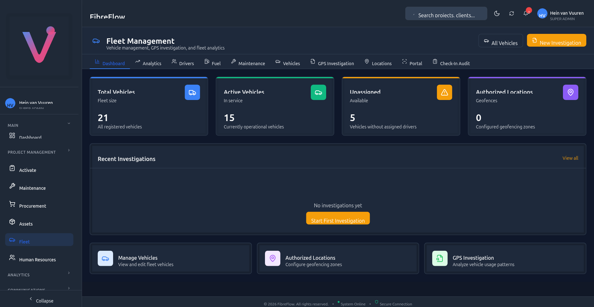
*Figure 8.1: Fleet Dashboard showing vehicle count, fuel spend, maintenance alerts, and driver stats*

### 8.2 Vehicles

**Navigation:** Fleet → **Vehicles** tab

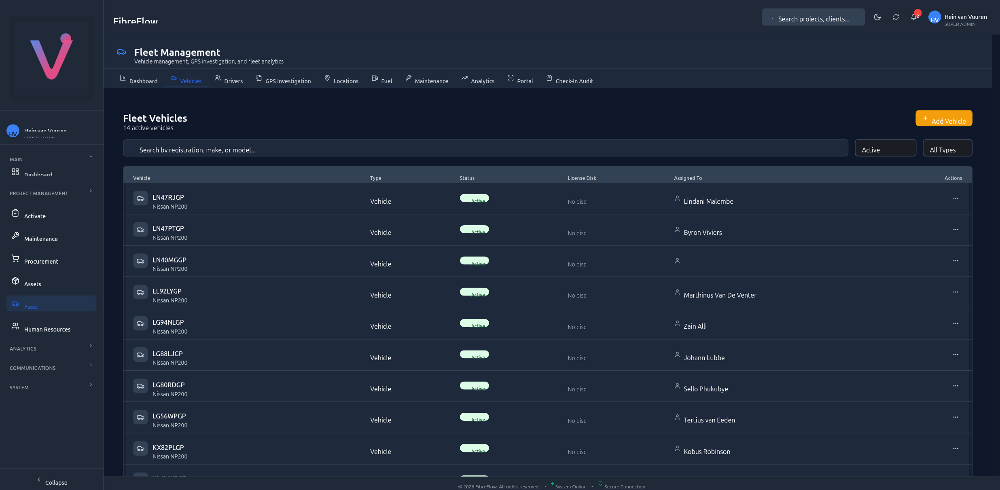
*Figure 8.2: Fleet vehicles list showing registration, make, driver assignment, and status*

#### Vehicle Information

Each vehicle record includes:
- Registration number and VIN
- Make, model, and year
- Assigned driver
- Current mileage
- Fuel level
- Service due date
- Insurance and license expiry
- Documents (registration, insurance, etc.)

### 8.3 Drivers

**Navigation:** Fleet → **Drivers** tab

- **Driver List** — All registered drivers with license status
- **Driver Detail** — Contact info, assigned vehicle, license details
- **Documents** — Upload and track:
  - Driver's license (front and back)
  - PrDP (Professional Driving Permit)
  - Medical certificate
- **License Expiry Alerts** — System warns when licenses are expiring

### 8.4 Vehicle Check-In

The daily/weekly vehicle inspection system with VLM-powered features.

**Navigation:** Fleet → **Check-In Audit** tab (or via Fleet Portal)

#### Check-In Process

1. **Plate Scan** — The driver photographs the vehicle license plate
2. **VLM Verification** — AI reads the plate and verifies it matches the assigned vehicle
3. **First-Time Calibration** (new vehicles only):
   - Enter current odometer reading
   - Select current fuel level (0-100%)
   - Upload dashboard photo
4. **Inspection Checklist** — Complete the inspection items:
   - Tire condition
   - Lights and indicators
   - Fluid levels
   - Body damage
   - Interior cleanliness
5. **Dashboard Reading** — VLM reads the dashboard photo to extract:
   - Odometer reading
   - Fuel level
   - Warning lights
6. **Photos** — Upload photos of any issues found
7. **Submit** — Complete the check-in

> **Tip:** The VLM (AI) reads license plates and dashboard displays automatically. However, always verify the readings are correct before submitting.

### 8.5 Fuel Management

**Navigation:** Fleet → **Fuel** tab

- **Fuel Transactions** — Record fuel purchases with receipt scanning
- **Fuel Summary** — Total fuel spend by vehicle, driver, and period
- **Anomaly Detection** — System flags unusual fuel consumption patterns
- **Fuel Level Tracking** — Historical fuel levels from check-in data

### 8.6 Fleet Maintenance

**Navigation:** Fleet → **Maintenance** tab

- Schedule vehicle service and maintenance
- Track service history
- Set recurring maintenance intervals (km-based or time-based)
- View upcoming and overdue service items
- Manage service providers and costs

### 8.7 GPS Investigation

**Navigation:** Fleet → **GPS Investigation** tab

- **Upload GPS Data** — Import CSV files from GPS tracking devices
- **Trip Analysis** — View individual trips with routes, stops, and speeds
- **Anomaly Detection** — Flag unauthorized trips, excessive speed, or unusual routes
- **Driver Scorecards** — Performance ratings based on driving behavior

### 8.8 Locations & Portal

**Navigation:** Fleet → **Locations** / **Portal** tabs

- **Locations** — Manage depot and parking locations
- **Portal** — Self-service driver portal for check-ins and reporting

---

## 9. Human Resources

The Human Resources module manages staff information, departments, compliance, and organizational structure.

### 9.1 Staff Directory

**Navigation:** Sidebar → **Human Resources** (click section header)

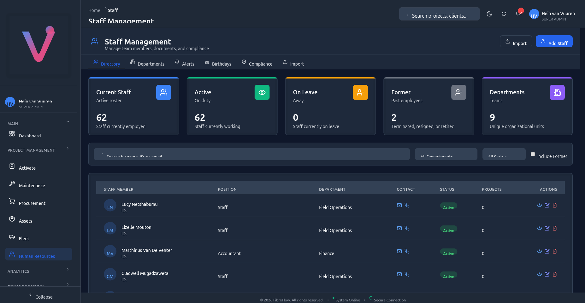
*Figure 9.1: Staff Directory showing employee list with search, department filter, and status*

#### Features

- **Search** — Find staff by name, email, or employee number
- **Filters** — Filter by department, position, status (active/inactive)
- **Grid/List View** — Toggle between card and table layouts
- **Quick Actions** — Add new staff member, export list

### 9.2 Staff Detail

Click any staff member to view their full profile:


*Figure 9.2: Staff detail page showing personal info, employment details, and compliance status*

#### Tabs

| Tab | Content |
|-----|---------|
| **Overview** | Personal info, contact, address, identity documents |
| **Employment** | Position, department, start date, reporting line |
| **Compliance** | Document status, training records, certifications |
| **Notes** | Internal notes and communications log |
| **Projects** | Projects this staff member is assigned to |

#### Editing Staff

1. Click **Edit** on the staff detail page
2. The edit form has three sections:
   - **Overview** — Personal info, contact details, next of kin
   - **Employment** — Position, department, salary, contract type
   - **Compliance** — Document uploads and status tracking
3. Make changes and click **Save**

### 9.3 Departments

**Navigation:** Human Resources → **Departments** tab

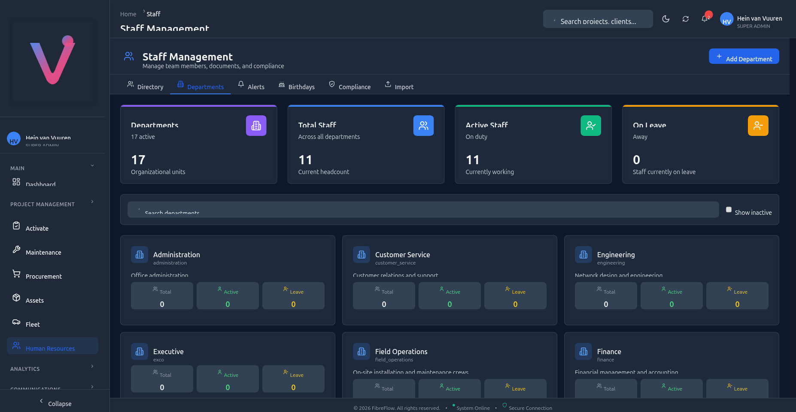
*Figure 9.3: Departments grid showing department cards with member counts and status*

- View all departments as cards with member count
- Create new departments
- Edit department details
- View department reports (headcount, growth trends)

### 9.4 Alerts & Birthdays

**Navigation:** Human Resources → **Alerts** / **Birthdays** tabs

- **Alerts** — Expiring documents, overdue compliance items, license renewals
- **Birthdays** — Upcoming staff birthdays for team recognition

### 9.5 Compliance Tracking

**Navigation:** Human Resources → **Compliance** tab

Track staff document compliance:
- Driver's licenses
- Medical certificates
- Safety training
- Background checks
- Professional certifications

Each document type shows:
- Status (Valid, Expiring, Expired, Missing)
- Expiry date
- Upload date
- Alert thresholds

### 9.6 Staff Import

**Navigation:** Human Resources → **Import** tab **(Admin only)**

- **Upload CSV/Excel** — Bulk import staff records
- **Field Mapping** — Map file columns to staff fields
- **Validation** — Preview and fix errors before import
- **Overwrite Option** — Choose whether to update existing records

---

## 10. Analytics

The Analytics section provides dashboards and reports for organizational performance insights.

### 10.1 Analytics Dashboard

**Navigation:** Sidebar → **Analytics** → **Analytics Dashboard**

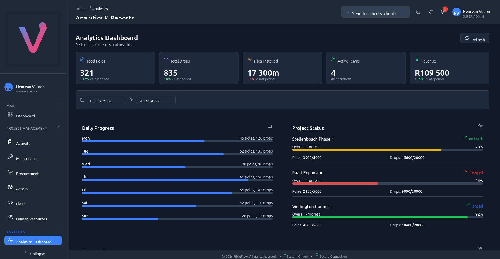
*Figure 10.1: Analytics Dashboard showing project metrics, team performance, and trend charts*

#### Components

- **Statistics Cards** — Key metrics at a glance (projects, completions, revenue, issues)
- **Daily Progress Chart** — Visual timeline of daily progress across projects
- **Project Status View** — Distribution of projects by status
- **Team Performance Table** — Staff productivity metrics
- **Key Insights** — AI-generated insights and recommendations

### 10.2 Enhanced KPIs

**Navigation:** Sidebar → **Analytics** → **Enhanced KPIs**

Advanced Key Performance Indicator tracking with:
- Custom KPI definitions
- Target vs actual tracking
- Trend visualization over time
- Drill-down by project, team, or period

### 10.3 KPI Dashboard

**Navigation:** Sidebar → **Analytics** → **KPI Dashboard**

A focused view of the most important operational KPIs:
- Installation completion rates
- Maintenance response times
- QA pass rates
- Financial metrics

### 10.4 Reports

**Navigation:** Sidebar → **Analytics** → **Reports**

Generate and export operational reports:
- **Project Reports** — Progress, timeline adherence, budget
- **Staff Reports** — Productivity, attendance, compliance
- **Financial Reports** — Revenue, expenses, profitability
- **Operational Reports** — Ticket volumes, SLA compliance

---

## 11. Communications

The Communications section manages WhatsApp integration, meeting coordination, and team notifications.

### 11.1 Communications Portal

**Navigation:** Sidebar → **Communications** → **Communications Portal**

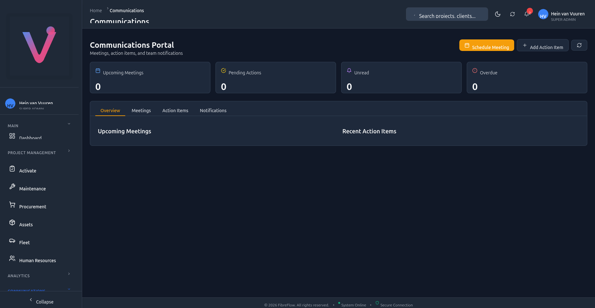
*Figure 11.1: Communications Portal showing messaging overview and notification channels*

A unified view of organizational communications:
- Overview statistics
- Recent communications
- Notification channels
- Action items from communications

### 11.2 WhatsApp Administration

**(Admin only)**

**Navigation:** Sidebar → **Communications** → **WhatsApp Portal**

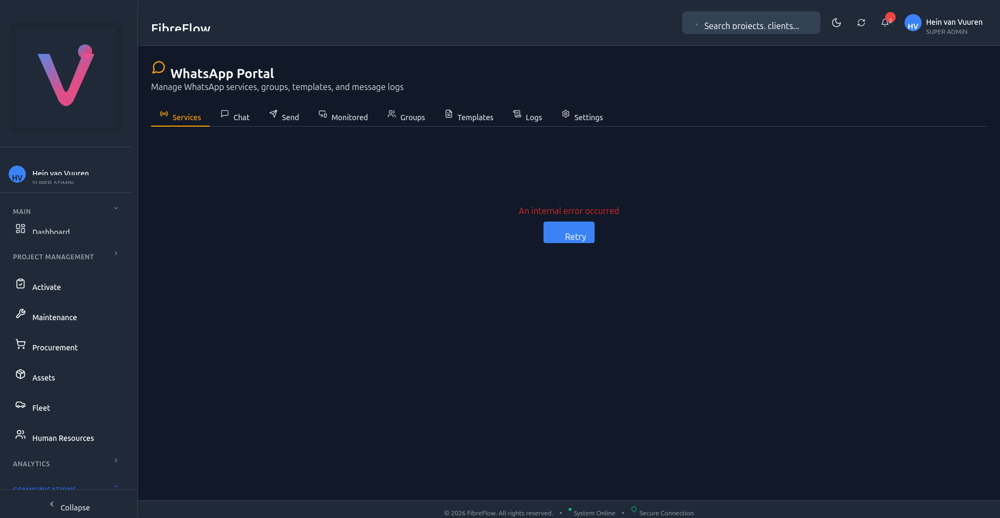
*Figure 11.2: WhatsApp Administration showing groups, message logs, and service health*

#### Tabs

| Tab | Purpose |
|-----|---------|
| **Groups** | Manage WhatsApp project groups |
| **Logs** | View message delivery logs with export |
| **Templates** | Manage message templates |
| **Services** | Monitor WhatsApp service health (Sender, Bridge, Feedback) |
| **Settings** | Configure WhatsApp integration settings |

#### Key Features

- **Group Management** — Create and manage WhatsApp groups per project
- **Message Logs** — Search, filter, and export message history
- **Template Management** — Create reusable message templates
- **Service Health** — Monitor the health of WhatsApp infrastructure:
  - **Sender** (port 8081) — Sends outgoing messages
  - **Bridge** (port 8083) — Receives DR submissions
  - **Feedback** (port 8092) — Sends QA feedback

### 11.3 PDF Tools

**Navigation:** Sidebar → **Communications** → **PDF Tools**

A collection of PDF manipulation tools:
- Merge PDFs
- Split PDFs
- Convert documents to PDF
- Compress PDFs
- Rotate pages
- Add watermarks

---

## 12. System Administration

The System section provides administrative tools for monitoring, data management, and configuration.

**(Admin only — most features)**

### 12.1 System Health Hub

**Navigation:** Sidebar → **System** → **System Health Hub**

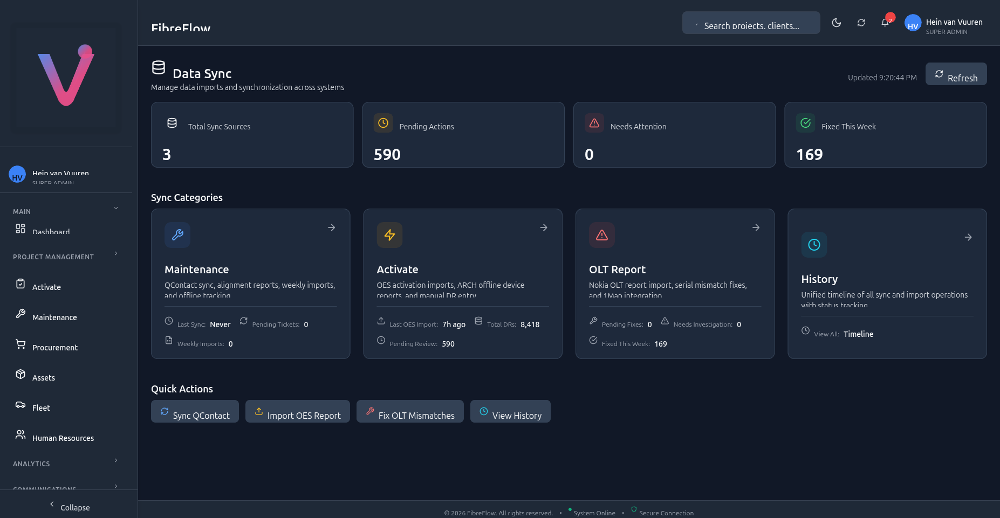
*Figure 12.1: System Health Hub showing service status, API health, and recent alerts*

Monitor the health of all FibreFlow services:
- **API Health** — Status of all API endpoints
- **Database** — Connection pool status and query performance
- **External Services** — VLM, QContact, Smartsheet, OneMap connectivity
- **Job Queue** — Background task processing status
- **Error Tracking** — Recent errors and their frequency

### 12.2 Data Sync

**Navigation:** Sidebar → **System** → **Data Sync**


*Figure 12.2: Data Sync page showing sync operations, OLT report, and operation history*

Manage data synchronization across systems:

#### Sync Groups

| Group | Description |
|-------|-------------|
| **OLT Report** | Import and fix ONT serial mismatches from OLT reports |
| **OES Sync** | Import OES activation data from Excel |
| **SharePoint Sync** | Sync DR data from SharePoint |
| **QField Sync** | Push coordinates to QField for field mapping |
| **1Map Sync** | Sync serial numbers with 1Map (OneMap) |
| **QContact Sync** | Maintenance ticket synchronization |

#### OLT Report (Special Feature)

The OLT Report tool manages ONT serial number corrections:
1. Import OLT mismatch report (Excel)
2. View mismatched records (wrong serial in 1Map)
3. **Auto-fix** — System corrects serials in 1Map via API
4. **Investigate** — Records needing manual lookup
5. **Reporting** — Track fixes by date, status, and import batch

### 12.3 Infrastructure

**Navigation:** Sidebar → **System** → **Infrastructure**

Monitor FibreFlow infrastructure:
- Server status (Production, Staging, Dev)
- Service health checks
- Resource utilization
- Links to external monitoring (xyOps, Grafana)

### 12.4 Settings

**Navigation:** Sidebar → **System** → **Settings**

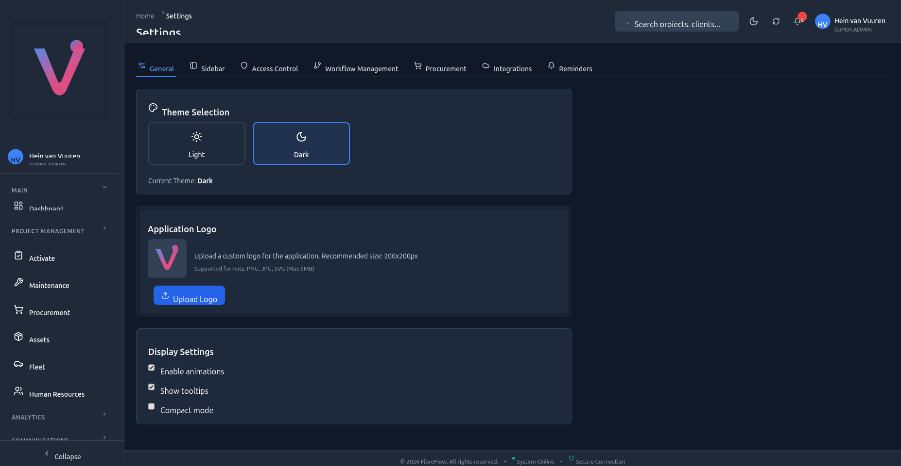
*Figure 12.3: Settings page showing organizational, procurement, and user preference tabs*

#### Settings Tabs

| Tab | Content |
|-----|---------|
| **General** | Organization name, branding, defaults |
| **Procurement** | Approval thresholds, default terms, tax rates |
| **User Preferences** | Sidebar customization, theme, notifications |
| **Positions** | Manage staff positions |
| **Departments** | Manage department list |
| **Hierarchy** | Reporting structure configuration |

#### Sidebar Customization

Users can customize their sidebar by:
1. Go to **Settings** → **User Preferences**
2. Select which sections to show/hide
3. Reorder sections by drag-and-drop
4. Save preferences (stored per user)

### 12.5 Imports & Downloads

**Navigation:** Sidebar → **System** → **Imports** / **Downloads**

- **Imports** — SOW document import with data extraction
- **Downloads** — Export templates, reports, and data extracts

---

## 13. Appendices

### Appendix A: Role Permissions Matrix

| Module | Super Admin | Admin | Manager | Technician | Viewer | Contractor |
|--------|:-----------:|:-----:|:-------:|:----------:|:------:|:----------:|
| Dashboard | Full | Full | Full | View | View | — |
| Projects | Full | Full | Full | View | View | Assigned |
| Clients | Full | Full | Full | — | View | — |
| Contractors | Full | Full | Full | — | View | Own |
| Activate | Full | Full | Full | — | View | — |
| Maintenance | Full | Full | Full | Assigned | View | — |
| Procurement | Full | Full | Full | — | View | — |
| Assets | Full | Full | Full | Checkout | View | — |
| Fleet | Full | Full | Full | Own | View | — |
| HR / Staff | Full | Full | View | Own | — | — |
| Analytics | Full | Full | Full | — | View | — |
| Communications | Full | Full | View | — | View | — |
| WhatsApp Admin | Full | Full | — | — | — | — |
| System Admin | Full | — | — | — | — | — |
| Settings | Full | Full | Limited | — | — | — |

**Legend:** Full = All CRUD operations | View = Read only | Assigned = Only assigned items | Own = Only own records | — = No access

### Appendix B: Keyboard Shortcuts

| Shortcut | Action |
|----------|--------|
| **Tab** | Navigate between form fields |
| **Shift+Tab** | Navigate backwards between fields |
| **Escape** | Close modal or cancel action |
| **Ctrl+Enter** | Submit form |
| **Ctrl+K** | Open global search (where available) |
| **/** | Focus search bar (on list pages) |

### Appendix C: Glossary of Terms

| Term | Definition |
|------|-----------|
| **BOQ** | Bill of Quantities — itemized list of materials for a project |
| **DR** | Drop Reference — unique identifier for a fiber drop point (e.g., DR1738371) |
| **FT Number** | FiberTime reference number from QContact (e.g., FT695563) |
| **GRN** | Goods Receipt Note — document confirming receipt of ordered items |
| **KPI** | Key Performance Indicator — measurable metric for tracking performance |
| **OES** | Operation Engineering Support — Nokia activation data |
| **OLT** | Optical Line Terminal — equipment at the service provider end |
| **ONT** | Optical Network Terminal — customer premises equipment |
| **PO** | Purchase Order — formal order to a supplier |
| **PON** | Passive Optical Network — fiber distribution network |
| **QA** | Quality Assurance — verification process for installations |
| **QContact** | FiberTime's CRM system (fibertime.qcontact.com) |
| **QField** | Mobile GIS application for field mapping |
| **RBAC** | Role-Based Access Control — permission system |
| **RFQ** | Request for Quotation — invitation for suppliers to bid |
| **SLA** | Service Level Agreement — response time target |
| **SOW** | Scope of Work — project scope document defining work |
| **VLM** | Vision Language Model — AI for analyzing photos |
| **VPS** | Virtual Private Server — remote server infrastructure |

### Appendix D: System Architecture

#### Environments

| Environment | URL | Purpose |
|-------------|-----|---------|
| **Production** | app.fibreflow.app | Live system |
| **Staging** | vf.fibreflow.app | Pre-release testing |
| **Development** | dev.fibreflow.app | Feature development |
| **Backup** | backup.fibreflow.app | Redundancy |

#### External Integrations

| System | Purpose | Sync Method |
|--------|---------|-------------|
| **QContact** | Maintenance CRM | API (bidirectional) |
| **Smartsheet** | Pipeline tracking | API (import) |
| **Fireflies.ai** | Meeting transcription | API (import) |
| **1Map / OneMap** | GIS data (drops, photos) | API (bidirectional) |
| **QField** | Mobile GIS mapping | GeoJSON push |
| **Odoo** | ERP (inventory, POs) | API (import) |
| **Firebase** | File storage | SDK |
| **SharePoint** | Document sync | API (import) |

### Appendix E: Troubleshooting Guide

#### General Issues

| Problem | Solution |
|---------|----------|
| **Page not loading** | Refresh the page. Check your internet connection. Try clearing browser cache. |
| **"Unauthorized" error** | Your session may have expired. Log out and log back in. |
| **Missing menu items** | Your role may not have access. Contact your administrator. |
| **Data not updating** | Try refreshing the page. Some data syncs on intervals (e.g., QContact). |
| **Slow performance** | Check your internet speed. Try a different browser. Close unnecessary tabs. |

#### Module-Specific Issues

| Module | Problem | Solution |
|--------|---------|----------|
| **Activate** | Photos not loading | Check if the 1Map API is responding. Photos require VPS connectivity. |
| **Activate** | VLM categorization wrong | Correct the categorization manually — corrections improve future accuracy. |
| **Maintenance** | QContact sync failed | Check Data Sync tab for error details. Try manual sync. |
| **Maintenance** | Cannot move ticket status | Check required fields (fault cause, verification). Verify RBAC permissions. |
| **Procurement** | BOQ import fails | Ensure Excel has headers in row 1. Check column mapper for correct mappings. |
| **Procurement** | PO stuck in approval | Check Approvals tab. The assigned approver may need to take action. |
| **Fleet** | Plate scan not recognized | Ensure good lighting and clear plate photo. Enter plate manually if needed. |
| **Assets** | Cannot delete asset | Assets must be checked in (status: Available) before deletion. |
| **HR** | Import errors | Check CSV formatting. Required fields: first_name, last_name, email. |

---

*This manual is maintained by the Velocity Fibre development team. For questions, corrections, or feature requests, contact the system administrator.*

*Document generated: 31 January 2026*
