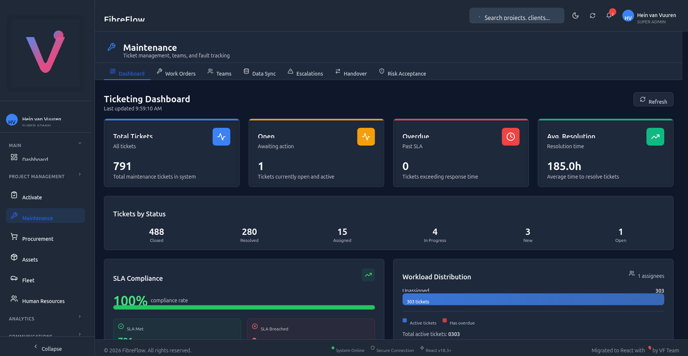
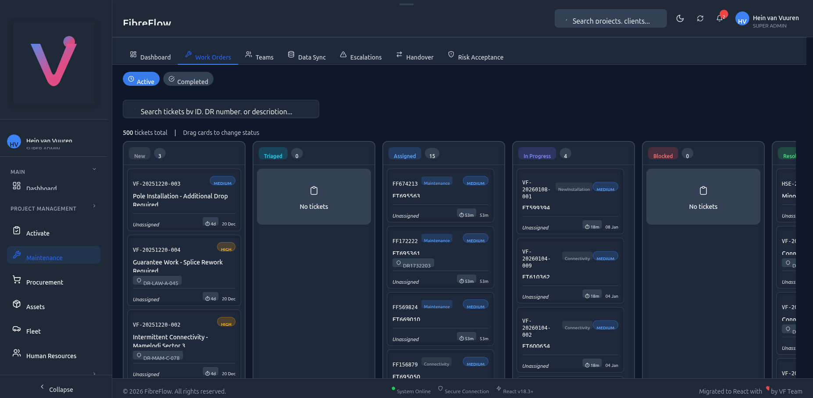
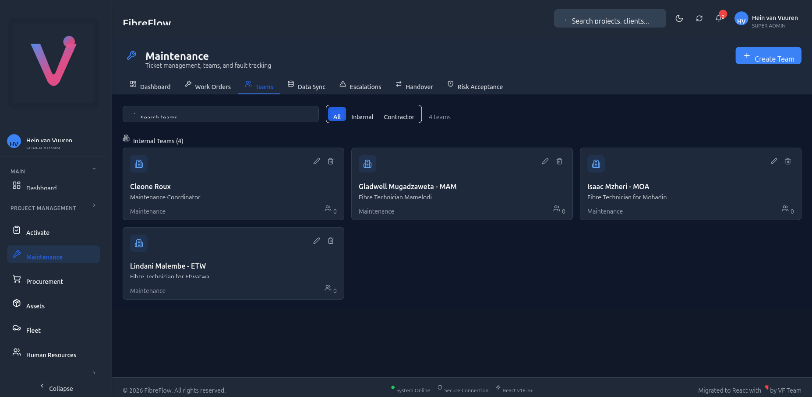
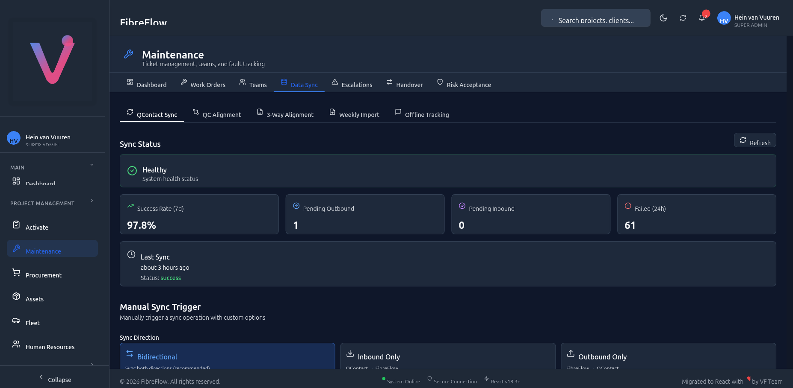
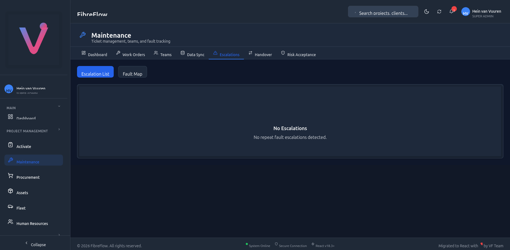
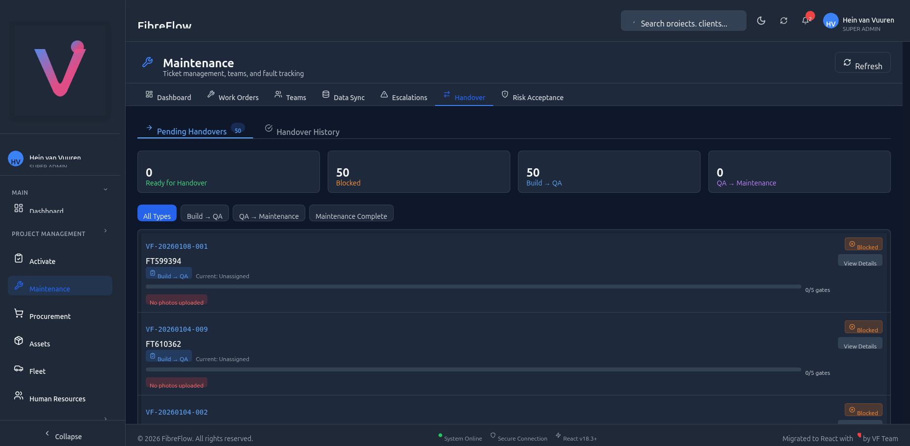
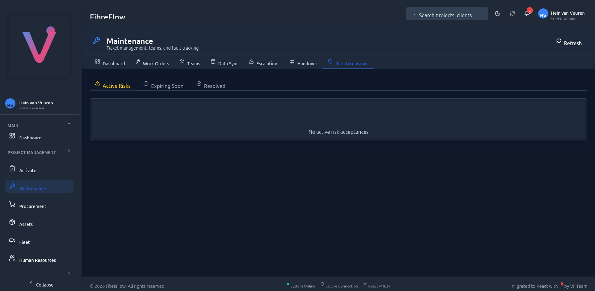

# FibreFlow Maintenance Module - User Manual

**Version:** 1.0
**Last Updated:** 27 January 2026
**Module:** Maintenance
**Application:** FibreFlow (dev.fibreflow.app)

---

## Table of Contents

1. [Overview](#1-overview)
2. [Getting Started](#2-getting-started)
3. [Dashboard](#3-dashboard)
4. [Work Orders (Tickets)](#4-work-orders)
5. [Kanban Board](#5-kanban-board)
6. [Creating a Ticket](#6-creating-a-ticket)
7. [Ticket Detail & Lifecycle](#7-ticket-detail--lifecycle)
8. [Teams Management](#8-teams-management)
9. [Data Sync & QContact Integration](#9-data-sync--qcontact-integration)
10. [Escalations & Fault Analysis](#10-escalations--fault-analysis)
11. [Handover Management](#11-handover-management)
12. [Risk Acceptance](#12-risk-acceptance)
13. [QContact vs FibreFlow Comparison](#13-qcontact-vs-fibreflow-comparison)
14. [Common Workflows](#14-common-workflows)
15. [Troubleshooting](#15-troubleshooting)

---

## 1. Overview

The **Maintenance Module** is FibreFlow's comprehensive fiber network maintenance management system. It handles:

- **Ticket lifecycle management** - From creation to closure
- **Team coordination** - Assign technicians and contractors
- **QA verification** - 12-step verification checklists
- **Handover workflows** - Controlled transitions between teams
- **QContact CRM integration** - Bidirectional sync with FiberTime QContact
- **SLA tracking** - Priority-based response time monitoring
- **Repeat fault escalation** - Automatic detection of recurring issues

### Who Uses This Module?

| Role | Access Level |
|------|-------------|
| **Super Admin** | Full access to all sections |
| **Manager** | Dashboard, tickets, teams, sync, escalations |
| **Technician** | View/update assigned tickets, verification steps |
| **QA Reviewer** | QA approval, risk acceptance |
| **Coordinator** | Dashboard, ticket creation, team assignment |

---

## 2. Getting Started

### Navigating to Maintenance

1. Log in to FibreFlow at **dev.fibreflow.app**
2. In the left sidebar, click **Maintenance** under "Project Management"
3. You will see the Maintenance module with 7 tabs:
   - **Dashboard** - Overview statistics
   - **Work Orders** - Kanban/list view of all tickets
   - **Teams** - Manage maintenance teams
   - **Data Sync** - QContact sync and imports
   - **Escalations** - Repeat fault detection
   - **Handover** - Team transition management
   - **Risk Acceptance** - Conditional QA approvals


*Figure 1: Maintenance Dashboard showing ticket statistics, SLA compliance, and workload distribution*

---

## 3. Dashboard

The Dashboard provides a real-time overview of your maintenance operations.

### Statistics Cards

| Card | Description |
|------|-------------|
| **Total Tickets** | All maintenance tickets in the system |
| **Open** | Tickets currently open and awaiting action |
| **Overdue** | Tickets that have exceeded their SLA response time |
| **Avg. Resolution** | Average time to resolve tickets (in hours) |

### Tickets by Status

A breakdown showing how many tickets are in each status:
- **Closed** - Completed tickets
- **Resolved** - Work completed, pending final closure
- **Assigned** - Assigned to a technician
- **In Progress** - Actively being worked on
- **New** - Newly created, not yet assigned
- **Open** - Awaiting action

### SLA Compliance

Shows the percentage of tickets meeting their SLA targets. Each priority level has a different SLA:

| Priority | SLA Target |
|----------|-----------|
| Critical | 6 hours |
| Urgent | 12 hours |
| High | 1 day |
| Normal | 3 days |
| Low | 7 days |

### Workload Distribution

Shows how many tickets are assigned to each team member, helping managers balance workloads.

> **Tip:** The dashboard auto-refreshes every 30 seconds. Click the **Refresh** button for an immediate update.

---

## 4. Work Orders

The Work Orders tab is the main ticket management view. It provides two ways to view tickets:

1. **Kanban Board** (default) - Visual drag-and-drop columns
2. **Table View** - Traditional filterable list

### Switching Between Views

- Click the **Active** toggle to see active (non-closed) tickets
- Click the **Completed** toggle to see resolved/closed tickets

### Search

Use the search bar at the top to find tickets by:
- Ticket ID (e.g., FT695563)
- DR number (e.g., DR1732203)
- Description keywords


*Figure 2: Kanban Board showing tickets organized by status columns with drag-and-drop*

---

## 5. Kanban Board

The Kanban Board displays tickets as cards organized in status columns. Drag cards between columns to change their status.

### Columns

| Column | Status | Description |
|--------|--------|-------------|
| **New** | `new` | Newly created tickets |
| **Triaged** | `triaged` | Assessed and categorized |
| **Assigned** | `assigned` | Assigned to a technician |
| **In Progress** | `in_progress` | Work is actively underway |
| **Blocked** | `blocked` | Work is blocked by an issue |
| **Resolved** | `resolved` | Work completed |
| **Closed** | `closed` | Ticket fully closed |

### Card Information

Each card shows:
- **Ticket ID** (e.g., VF-20260108-001)
- **FT Number** (QContact reference, e.g., FT695563)
- **Category badge** (Maintenance, Connectivity, NewInstallation)
- **Priority badge** (Medium, High, Critical)
- **DR Number** (if linked to a drop)
- **Assignee** name
- **SLA indicator** (time remaining)
- **Created date**

### Drag-and-Drop

To change a ticket's status:
1. Click and hold a ticket card
2. Drag it to the target column
3. Release to drop
4. The status updates automatically and syncs to QContact

### Sorting

Cards within each column are sorted by:
1. **Priority** (Critical first, then Urgent, High, Normal, Low)
2. **Date** (newest first within same priority)

---

## 6. Creating a Ticket

### Steps to Create a New Ticket

1. Navigate to **Work Orders** tab
2. Click the **+ Create Ticket** button (top-right)
3. Fill in the required fields:

#### Required Fields

| Field | Description |
|-------|-------------|
| **Title** | Short description of the issue |
| **Type** | Maintenance, New Installation, Modification, ONT Swap, or Incident |
| **Priority** | Low, Normal, High, Urgent, or Critical |
| **Source** | Where the ticket originated (Manual, QContact, Weekly Report, etc.) |

#### Optional Fields

| Field | Description |
|-------|-------------|
| **Description** | Detailed description of the issue |
| **DR Number** | Drop reference number (auto-populates location data) |
| **Client Name** | Customer name |
| **Client Phone** | Customer contact number |
| **ONT Serial** | ONT device serial number |
| **Assign to Team** | Which team should handle this |
| **Assign to User** | Specific technician |

#### DR Number Lookup

When you enter a DR number, the system automatically looks up:
- Pole number
- PON number
- Zone number
- Project name
- Address
- Coordinates
- Municipality

> **Tip:** You can pre-populate the create form via URL parameters:
> `/maintenance/tickets/new?dr_number=DR1234&source=manual&priority=urgent`

### Ticket Types

| Type | Description | DR Required? |
|------|-------------|-------------|
| **Maintenance** | Repair existing fiber network issue | Yes |
| **New Installation** | New fiber drop installation | Yes |
| **Modification** | Modify existing installation (relocation, upgrade) | Yes |
| **ONT Swap** | Replace or swap ONT device | Yes |
| **Incident** | Network incident affecting multiple customers | No |

### Ticket Sources

| Source | Description | Created By |
|--------|-------------|-----------|
| **Manual** | Created via FibreFlow UI | User |
| **QContact** | Synced from QContact CRM | Automatic |
| **Weekly Report** | Imported from Excel reports | Import wizard |
| **Construction** | Created during construction | User |
| **Ad Hoc** | Special request | User |
| **Incident** | Network incident | User |
| **ONT Swap** | ONT replacement request | User |

---

## 7. Ticket Detail & Lifecycle

### Ticket Statuses

Tickets follow a defined workflow. Each status represents a stage in the ticket lifecycle:

```
NEW → ASSIGNED → IN_PROGRESS → PENDING_QA → QA_IN_PROGRESS
                                                    ↓
                                        QA_APPROVED → PENDING_HANDOVER → HANDED_TO_OPS → CLOSED
                                        QA_REJECTED → back to IN_PROGRESS
```

| Status | Meaning | Next Steps |
|--------|---------|-----------|
| **Open** | Created but not assigned | Assign to technician |
| **Assigned** | Assigned, work not started | Start work |
| **In Progress** | Work actively underway | Complete verification, submit for QA |
| **Pending QA** | Waiting for QA review | QA reviewer picks up |
| **QA In Progress** | QA actively reviewing | Approve or reject |
| **QA Rejected** | Failed QA review | Technician reworks |
| **QA Approved** | Passed QA review | Proceed to handover |
| **Pending Handover** | Waiting for team transition | Complete handover |
| **Handed to Ops** | Transitioned to operations | Close ticket |
| **Closed** | Ticket complete | Terminal state |
| **Cancelled** | Ticket cancelled | Terminal state |

### Priority Levels

| Priority | Color | SLA | When to Use |
|----------|-------|-----|-------------|
| **Low** | Gray | 7 days | Non-urgent, scheduled work |
| **Normal** | Blue | 3 days | Standard priority |
| **High** | Orange | 1 day | Important, prioritize |
| **Urgent** | Red | 12 hours | Immediate attention needed |
| **Critical** | Red (pulsing) | 6 hours | Drop everything |

### Fault Cause Attribution

Every maintenance ticket requires a **Fault Cause** - this determines accountability:

| Fault Cause | Contractor Liable? | Examples |
|-------------|-------------------|----------|
| **Workmanship** | YES | Improper splicing, loose connections, incorrect routing |
| **Material Failure** | No | Defective ONT, faulty cable, broken connector |
| **Client Damage** | No | Customer unplugged ONT, cable cut during renovation |
| **Third Party** | No | Municipal road work, excavator damage |
| **Environmental** | No | Wind damage, lightning strike, water ingress |
| **Vandalism** | No | Cable deliberately cut, equipment stolen |
| **Unknown** | No | Cannot determine root cause |

> **Important:** Fault cause selection directly affects contractor billing. Choose accurately to prevent unfair attribution.

---

## 8. Teams Management

The Teams tab lets you manage maintenance teams and their members.


*Figure 3: Teams management page showing internal maintenance teams*

### Features

- **Create Team** - Click "+ Create Team" button (top-right)
- **Search** - Filter teams by name
- **Filter by Type** - All, Internal, or Contractor
- **Edit** - Click the pencil icon on a team card
- **Delete** - Click the trash icon on a team card

### Team Types

| Type | Description |
|------|-------------|
| **Internal** | In-house maintenance staff |
| **Field** | Field technicians |
| **Support** | Technical support team |
| **Maintenance** | General maintenance team |
| **Installation** | New installation team |
| **Contractor** | External contractor team |

### Creating a Team

1. Click **+ Create Team**
2. Enter:
   - **Team Name** (e.g., "Gladwell Mugadzaweta - MAM")
   - **Team Type** (e.g., Maintenance)
   - **Description** (e.g., "Fibre Technician Mamelodi")
3. Click **Save**
4. Add team members after creation

---

## 9. Data Sync & QContact Integration

The Data Sync tab manages the bidirectional synchronization between FibreFlow and QContact (FiberTime).


*Figure 4: QContact Sync dashboard showing sync health, metrics, and manual trigger*

### Sub-Tabs

| Tab | Purpose |
|-----|---------|
| **QContact Sync** | Main sync dashboard and manual trigger |
| **QC Alignment** | Compare QContact and FibreFlow ticket statuses |
| **3-Way Alignment** | Cross-reference QC, FF, and Excel data |
| **Weekly Import** | Import tickets from Excel weekly reports |
| **Offline Tracking** | WhatsApp notification delivery tracking |

### QContact Sync Dashboard

#### Sync Status

| Metric | Description |
|--------|-------------|
| **Health Status** | Green = Healthy, Red = Issues detected |
| **Success Rate (7d)** | Percentage of successful syncs in last 7 days |
| **Pending Outbound** | FF changes waiting to push to QContact |
| **Pending Inbound** | QContact changes waiting to pull into FF |
| **Failed (24h)** | Failed sync attempts in last 24 hours |
| **Last Sync** | Timestamp and status of most recent sync |

#### Manual Sync Trigger

To manually trigger a sync:

1. Choose **Sync Direction**:
   - **Bidirectional** (recommended) - Sync both directions
   - **Inbound Only** - QContact → FibreFlow
   - **Outbound Only** - FibreFlow → QContact
2. Click **Start Sync**
3. Wait for completion (typically 30-60 seconds)
4. Review results in the toast notification

### How Sync Works

#### Inbound (QContact → FibreFlow)

1. FibreFlow queries QContact API for tickets assigned to "Maintenance - Velocity"
2. For each QContact ticket:
   - If not in FibreFlow → **Create** new ticket
   - If already in FibreFlow → **Update** status, category, etc.
3. Status mapping applied (see Section 13)
4. Category/subcategory parsed and stored

#### Outbound (FibreFlow → QContact)

1. When a ticket status changes in FibreFlow
2. If the ticket has a QContact external_id (FT number)
3. FibreFlow pushes the status update to QContact API
4. Reverse status mapping applied

### Automatic vs Manual Sync

| Type | Trigger | Direction |
|------|---------|-----------|
| **Automatic (Outbound)** | When user changes ticket status in FF | FF → QContact |
| **Manual (Any)** | User clicks "Start Sync" button | Configurable |
| **Scheduled (Inbound)** | Cron job (if configured) | QContact → FF |

---

## 10. Escalations & Fault Analysis

The Escalations tab detects and manages repeat fault patterns.


*Figure 5: Escalations page showing repeat fault detection status*

### What Are Escalations?

When the same fault pattern repeats across multiple tickets at the same location, the system automatically creates an **escalation** for infrastructure investigation.

### Escalation Scopes

| Scope | Description | Example |
|-------|-------------|---------|
| **Pole-Level** | Same fault on same pole | 3 "Signal loss" tickets on Pole 45 |
| **PON-Level** | Same fault on same PON | Multiple faults on PON 12 |
| **Zone-Level** | Same fault across a zone | Pattern of faults in Zone 3 |
| **DR-Level** | Same fault on same drop | Recurring issue at DR1234 |

### Severity Levels

| Severity | Repeat Count | Action Required |
|----------|-------------|----------------|
| **Medium** | 2 repeats | Monitor |
| **High** | 3-4 repeats | Investigate |
| **Critical** | 5+ repeats | Immediate investigation |

### Views

- **Escalation List** - Table of all detected escalations
- **Fault Map** - Geographic visualization of fault patterns

### Resolving an Escalation

1. Click on the escalation
2. Review linked tickets
3. Identify root cause
4. Create infrastructure repair ticket
5. Once resolved, mark escalation as resolved

---

## 11. Handover Management

The Handover tab manages the controlled transition of tickets between teams.


*Figure 6: Handover management showing pending handovers with gate progress*

### Handover Types

| Type | From | To |
|------|------|----|
| **Build → QA** | Build/installation team | QA review team |
| **QA → Maintenance** | QA team | Operations/maintenance team |
| **Maintenance Complete** | Maintenance team | Closed |

### Handover Gates (5 Mandatory Checks)

Before a handover can proceed, 5 gates must pass:

| Gate | Check | Description |
|------|-------|-------------|
| 1 | **Verification Complete** | All 12 verification steps done |
| 2 | **QA Status** | QA approval obtained |
| 3 | **Documentation** | All paperwork complete |
| 4 | **Client Signed Off** | Client has accepted work |
| 5 | **Financial** | Payment/billing resolved |

The progress bar shows **X/5 gates** passed. If any gate fails, the ticket shows as **Blocked** with specific blocker details.

### Sub-Tabs

- **Pending Handovers** - Tickets waiting for handover (with gate status)
- **Handover History** - Completed handover audit trail

### Performing a Handover

1. Navigate to **Handover** tab
2. Find the ticket in "Pending Handovers"
3. Click **View Details** to see gate status
4. Resolve any blockers (e.g., upload missing photos)
5. Once all 5 gates pass, click **Proceed with Handover**
6. Add handover notes
7. Confirm

---

## 12. Risk Acceptance

The Risk Acceptance tab manages conditional QA approvals where known issues are accepted with conditions.


*Figure 7: Risk Acceptance page showing active, expiring, and resolved risks*

### When Is Risk Acceptance Used?

- QA finds an issue that would normally fail approval
- But the project timeline is critical
- QA can **conditionally approve** with documented conditions

### Sub-Tabs

| Tab | Shows |
|-----|-------|
| **Active Risks** | Currently accepted risks with conditions |
| **Expiring Soon** | Risks approaching their expiry date |
| **Resolved** | Historical risks that have been resolved |

### Risk Acceptance Fields

| Field | Description |
|-------|-------------|
| **Risk Type** | Design, Material, Workmanship, Environmental |
| **Description** | What is the risk being accepted |
| **Conditions** | What must be true for approval |
| **Accepted By** | Who approved the risk |
| **Expiry Date** | By when must the issue be resolved |
| **Follow-up Date** | When to check on resolution progress |

---

## 13. QContact vs FibreFlow Comparison

FibreFlow integrates with **QContact** (FiberTime) for maintenance ticket management. Understanding the relationship between the two systems is critical.

### System Comparison

| Feature | QContact (FiberTime) | FibreFlow |
|---------|---------------------|-----------|
| **Purpose** | CRM - customer contact management | Project management - full workflow |
| **Ticket creation** | Manual or via forms | Manual, import, or sync |
| **Status tracking** | 9 statuses | 11 statuses (more granular) |
| **Verification** | None | 12-step checklist |
| **QA workflow** | None | Full QA approval cycle |
| **Handover** | None | 5-gate handover process |
| **Escalations** | None | Automatic repeat fault detection |
| **Risk acceptance** | None | Conditional approval workflow |
| **Team management** | Basic assignment | Full team management |
| **SLA tracking** | Basic | Priority-based with compliance % |

### Status Mapping (QContact → FibreFlow)

When tickets sync from QContact to FibreFlow, statuses are mapped as follows:

| QContact Status | QContact Column | FibreFlow Status | FF Column |
|----------------|-----------------|------------------|-----------|
| **New** | New | `open` | New |
| **Pending Customer** | Pending Customer | `open` | New |
| **Pending Company Response** | In Progress | `in_progress` | In Progress |
| **Assigned** | Assigned | `assigned` | Assigned |
| **In Progress** | In Progress | `in_progress` | In Progress |
| **Escalated** | Escalated | `in_progress` | In Progress |
| **In Review** | In Review | `pending_qa` | (QA Phase) |
| **Reviewed** | In Review | `qa_approved` | (QA Phase) |
| **Solved** | Solved | `closed` | Closed |
| **Unsolved - No Response** | Unsolved | `cancelled` | Cancelled |
| **Closed** | (Historical) | `closed` | Closed |

> **Key Insight:** QContact's "Pending Company Response" appears under the "In Progress" column in QContact's UI. FibreFlow maps this to `in_progress` to maintain visual alignment between both systems.

### Status Mapping (FibreFlow → QContact)

When changes are made in FibreFlow, they sync back to QContact:

| FibreFlow Status | QContact Status |
|------------------|----------------|
| `open` | New |
| `assigned` | Assigned |
| `in_progress` | In Progress |
| `pending_qa` | In Review |
| `qa_in_progress` | In Review |
| `qa_rejected` | In Progress |
| `qa_approved` | Reviewed |
| `pending_handover` | Reviewed |
| `handed_to_ops` | Solved |
| `closed` | Solved |
| `cancelled` | Unsolved - No Response |

### Category Mapping

QContact uses categories with separators (`::` or `|`). FibreFlow parses these into category + subcategory:

| QContact Category | FF Category | FF Subcategory | FF Ticket Type |
|-------------------|-------------|----------------|---------------|
| `Connectivity::ONT/Gizzu` | Connectivity | ONT/Gizzu | fault |
| `Connectivity::ONTMove` | Connectivity | ONTMove | ont_swap |
| `General\|Maintenance` | General | Maintenance | fault_repair |
| `Connectivity::New Installation` | Connectivity | New Installation | installation |
| `Connectivity::Signal Issue` | Connectivity | Signal Issue | fault |
| `Connectivity::Link Light` | Connectivity | Link Light | fault |
| `Connectivity::Bundle` | Connectivity | Bundle | fault |

### What Syncs Between Systems

| Data | Direction | Notes |
|------|-----------|-------|
| **Ticket status** | Bidirectional | Mapped per tables above |
| **Category/subcategory** | Inbound only | QC → FF |
| **Ticket type** | Inbound only | Derived from category |
| **Contact info** | Inbound only | From QContact case details |
| **FT number** | Inbound only | Used as external reference |
| **Created date** | Inbound only | Preserved from QContact |

### Side-by-Side Visual Comparison

**QContact Kanban (fibertime.qcontact.com):**


*Figure 8: QContact's kanban board showing ticket columns - note "In Progress" column includes "Pending Company Response" tickets*

**FibreFlow Kanban (dev.fibreflow.app):**


*Figure 9: FibreFlow's kanban board - same tickets appear in matching status columns after sync*

---

## 14. Common Workflows

### Workflow 1: Create and Complete a Maintenance Ticket

1. Go to **Work Orders** → **+ Create Ticket**
2. Fill in: Title, Type (Maintenance), Priority, DR Number
3. Assign to a technician
4. **Technician workflow:**
   - Views assigned ticket in Kanban "Assigned" column
   - Drags to "In Progress" to start work
   - Completes 12 verification steps
   - Uploads photos for each step
   - Selects **Fault Cause** (e.g., "Material Failure - Defective connector")
5. **QA workflow:**
   - Sees "Ready for QA" indicator
   - Reviews verification checklist and photos
   - Approves → ticket moves to "QA Approved"
6. **Handover:**
   - All 5 gates must pass
   - Handover to operations team
7. **Close ticket**

### Workflow 2: Handle a QA Rejection

1. Technician submits ticket for QA
2. QA reviewer finds issues → **Rejects**
3. Ticket returns to "In Progress"
4. Technician receives notification
5. Technician fixes the issue, re-uploads photos
6. Resubmits for QA
7. QA approves on second review

### Workflow 3: QContact Sync

1. New ticket created in QContact by FiberTime team
2. **Automatic inbound sync** pulls it into FibreFlow
3. Ticket appears in FibreFlow Kanban with correct status
4. FibreFlow user updates the status (e.g., Assigned → In Progress)
5. **Automatic outbound sync** pushes status back to QContact
6. Both systems stay aligned

### Workflow 4: Weekly Report Import

1. Go to **Data Sync** → **Weekly Import** tab
2. Click **Upload File** and select the Excel report
3. System parses and validates the data
4. Review preview - fix any errors
5. Click **Confirm Import**
6. Tickets are created and appear in the Kanban board

### Workflow 5: Respond to a Repeat Fault Escalation

1. Dashboard shows **Escalation Alert**: "3 signal loss faults on Pole 45"
2. Go to **Escalations** tab
3. Click escalation to see linked tickets
4. Investigate root cause (e.g., damaged patch panel)
5. Create infrastructure ticket for repair
6. Once fixed, mark escalation as resolved

---

## 15. Troubleshooting

### "Ticket not showing in Kanban"

- Check if you're viewing **Active** or **Completed** toggle
- Verify the ticket status matches a visible Kanban column
- Try refreshing the page
- Check search/filter isn't hiding the ticket

### "DR Lookup Failed"

- The DR number may not exist in the SOW (Scope of Work) module
- Check for typos in the DR number
- You can manually fill in location fields if lookup fails

### "QContact Sync Failed"

- Check the **Data Sync** → **QContact Sync** tab for error details
- Verify the sync health indicator
- Check **Failed (24h)** counter for recent errors
- Try a manual sync with "Bidirectional" direction
- If persistent, check QContact API availability

### "Cannot Move Ticket to Next Status"

- Certain status transitions are restricted (see status flow in Section 7)
- Verify all required fields are filled (fault cause, verification steps)
- Check if you have the right RBAC permissions

### "Handover Blocked"

- Check which of the 5 gates are failing
- Common blockers: missing photos, incomplete verification, no fault cause
- Resolve each blocker and the handover will unblock

### "SLA Shows Overdue"

- The SLA timer starts when the ticket is created
- Priority determines the SLA window (see Section 3)
- Overdue tickets appear in red on the dashboard
- To clear: resolve the ticket or adjust priority if incorrectly set

---

## Appendix A: Keyboard Shortcuts

| Shortcut | Action |
|----------|--------|
| **Tab** | Navigate between form fields |
| **Escape** | Cancel current dialog |
| **Ctrl+Enter** | Submit form |

## Appendix B: RBAC Permissions

| Permission Key | Description |
|---------------|-------------|
| `maintenance:tickets:view` | View and manage tickets |
| `maintenance:tickets:create` | Create new tickets |
| `maintenance:teams:view` | View and manage teams |
| `maintenance:data-sync:view` | Trigger syncs, view audit |
| `maintenance:escalations:view` | View and manage escalations |
| `maintenance:handover:view` | Manage handover workflow |
| `maintenance:risks:view` | View and manage risk acceptances |

## Appendix C: Glossary

| Term | Definition |
|------|-----------|
| **DR** | Drop Reference - unique identifier for a fiber drop point |
| **FT Number** | FiberTime reference number from QContact |
| **ONT** | Optical Network Terminal - customer premises equipment |
| **PON** | Passive Optical Network |
| **QContact** | FiberTime's CRM system (fibertime.qcontact.com) |
| **SLA** | Service Level Agreement - response time target |
| **WIP** | Work In Progress |
| **Gizzu** | Fiber enclosure/box at drop point |

---

*This manual is maintained by the FibreFlow development team. For questions or corrections, contact the system administrator.*

*Document generated: 27 January 2026*
